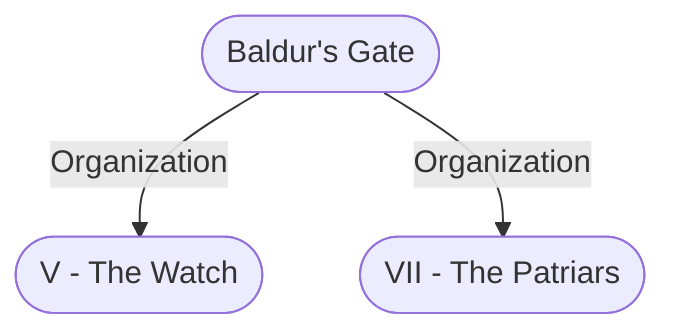

# Baldur's Gate
## Overview
**Commerce**: Exports dyes, fish, lamp oil, trade-coinage.

**Alignment**: Lawful Neutral
#Alignment/Lawful-Neutral

**Government**: Monarchy, Oligarchy
#Settlement-Government/Monarchy #Settlement-Government/Oligarchy

**Defense**: The Guard, [[IV - The Flaming Fist|The Flaming Fist]]

**Community Size**: Metropolis
#Community-Size/Metropolis

Baldur's Gate, also called simply the Gate, was a metropolis and city-state on the Sword Coast and Western Heartlands border, on the north bank of the River Chionthar about 20 miles (32 km) east from its mouth on the Sea of Swords. It was located to the south of the great city-state of [[Waterdeep]] and to the north of the country of Amn, and was located along the well-traveled Coast Way road.

This wealthy port metropolis, whose population, according to many accounts, exceeded that of [[Waterdeep]], was an important merchant city on the Sword Coast. Its strong watch and the presence of the powerful Flaming Fists mercenary company kept the city generally peaceful and safe.

Baldur's Gate consists of four different districts: [[II - Lower City|Lower City]], [[III - Outer City|Outer City]], [[I - Upper City|Upper City]] and [[IV - Wyrm's Crossing|Wyrm's Crossing]]. Some consider The Undercity and [[Little Calimshan]] to be a district as well.

### City Overview
Baldur’s Gate began its life as a hidden harbor where traders would meet with pirates and “ghost lighters,” folk along The Sword Coast who used lights to lure fogbound ships toward shore, where they would run aground and have their goods scavenged. After bit ting their targets, plunderers would journey leagues upriver to the future site of Baldur’s Gate, at a turn of the Chionthar that gave good harbor and relatively easy access to the [[Trade Way]], and then sell their booty to traders without fear of meeting the goods’ original owners. In time, industrious traders and herders decided that the excellent, albeit illicit, commerce outweighed the bluffs’ poor soil, and they put down roots. Due in part to its frequent mists and surely its residents’ reputations, the settlement became known as [[Gray Harbor]]—a name Baldurians still use for the bay today.

Balduran’s colleagues, sea captains to whom the harbor was home, angrily insisted the gate by which southern trade and the harbor traffic entered the city was “Baldur’s Gate,” and they refused to pay. They fought, overthrew the enriched traders and herders, and seized control of the city. The four oldest captains, their days at sea drawing to a close, turned over their ships to younger sailors, who in turn supported the captains’ installation as the fledgling city’s rulers. The aging skippers jok ingly called themselves “dukes,” hut the title proved useful in intercity negotiations. Following Amn’s founding, trade boomed in the Gate’s relaxed climate, and the city grew.

It burst its original bounds, consuming [[Gray Harbor]] as it grew up and down the bluffs. The fates of [[I - Upper City|Upper City]] and [[II - Lower City|Lower city]] were so entwined the dukes ruled the [[II - Lower City|Lower City]] couldn’t be left exposed to raiders. Thus, Baldur’s Gate erected two new wall segments along the bluffs that attached to the Old Wall, which was improved, and also kissed the River Chionthar twice, on the city’s western and eastern sides.    Today, Baldur’s Gate still refuses to he constrained. People and businesses blocked from residing within the walls huddle against them or sprawl along outly ing roads. What once was two communities now feels like three: the privileged [[I - Upper City|Upper City]], the hardworking [[II - Lower City|Lower City]] and the lawless [[III - Outer City|Outer City]].

The city gained its current name centuries ago when the great explorer Balduran returned from his journey to the other side of Evermeet, the homeland of the elves, where he searched for the fabled isles of [[Anchorome]]. He spread around wild stories of his adventures as well as huge amounts of wealth, some of which he spent to have a wall constructed around his oft-raided hometown. Balduran left again for [[Anchorome]] and never returned.    Balduran’s gate-dotted wall encircled the homes at the top of the bluffbut left the harbor arid the climb up the bluffs unprotected. This design allowed residents to tax goods coming to market.

## Description
**Population**: 120,000 in 1479 DR. A person from Baldur's Gate is known as a Baldurian.

### Baldur's Gate (City Only)

```leaflet
id: Baldur's Gate (City Only)
image: [[zjkdgtsh.1ki.png]]
height: 480.0px
draw: false
showAllMarkers: true
preserveAspect: true
bounds:
    - [0, 0]
    - [240.0, 300.0]
marker: default, 201.2, 148.9,[[High Hall (The Ducal Palace)]]
marker: default, 180.8, 184.6,[[The Wide (Open Marketplace)]]
marker: default, 183.1, 141.4,[[High House of Wonders (Temple of Gond)]]
marker: default, 179.5, 150.5,[[Hall of Wonders]]
marker: default, 99.5, 201.2,[[Elfsong Tavern (Tavern)]]
marker: default, 121.5, 106.4,[[The Seatower of Balduran]]
marker: default, 192.0, 124.2,[[The Lady's Hall (Temple of Tymora)]]
marker: default, 115.0, 222.0,[[Sorcerous Sundries (Reagent Shop)]]
marker: default, 157.2, 195.6,[[Felogyr's Fireworks (Fireworks Shop)]]
marker: default, 190.0, 140.9,[[The Helm and Cloak (Inn)]]
marker: default, 201.0, 170.2,[[Three Old Kegs (Inn & Tavern)]]
marker: default, 95.0, 215.2,[[The Blade and Stars (Inn)]]
marker: default, 143.9, 204.2,[[The Blushing Mermaid (Inn & Tavern)]]
marker: default, 168.4, 187.4,[[The Undercellar]]
marker: default, 183.2, 124.3,[[Krammoch Arkhstaff]]
marker: default, 185.0, 109.2,[[Ragefast]]
marker: default, 198.6, 172.5,[[Ramazith's Tower]]
marker: default, 201.1, 116.4,[[The Watchful Shield (Shrine of Helm)]]
marker: default, 136.1, 219.7,[[Shrine of Suffering (Shrine of Ilmater)]]
marker: default, 190.8, 205.7,[[The Rose Portal (Shrine of Lathander)]]
marker: default, 174.1, 169.6,[[The Unscrolling Scroll (Shrine of Oghma)]]
marker: default, 137.5, 140.1,[[The Water Queen's House (Temple of Umberlee)]]
```
[[zjkdgtsh.1ki.png|This is the more detailed of the city maps but it lacks the context of the surrounding areas. It is from the Forgotten Realms Atlas so it is a little older.]]

### Baldur's Gate and Surrounding Areas

```leaflet
id: Baldur's Gate and Surrounding Areas
image: [[mzuzjsze.t44.png]]
height: 312.8px
draw: false
showAllMarkers: true
preserveAspect: true
bounds:
    - [0, 0]
    - [156.4, 236.6]
marker: default, 114.8, 36.2,[[High Hall (The Ducal Palace)]]
marker: default, 144.5, 10.0,,unknown
marker: default, 138.1, 66.0,[[I - Upper City]]
marker: default, 89.4, 63.2,[[II - Lower City]]
marker: default, 131.8, 177.1,[[III - Outer City]]
marker: default, 56.9, 209.2,[[Wyrm's Rock]]
marker: default, 46.9, 213.9,[[IV - Wyrm's Crossing]]
marker: default, 57.5, 140.9,[[IV - Wyrm's Crossing]]
marker: default, 23.2, 228.1,[[IV - Wyrm's Crossing]]
marker: default, 117.3, 24.3,[[Watch Citadel]]
marker: default, 125.1, 51.6,[[The Wide (Open Marketplace)]]
marker: default, 108.8, 39.6,[[High House of Wonders (Temple of Gond)]]
marker: default, 110.7, 44.5,[[Hall of Wonders]]
marker: default, 86.4, 19.4,[[The Silvershield Estate]]
marker: default, 80.7, 54.9,[[The Seatower of Balduran]]
marker: default, 98.1, 56.2,[[The Water Queen's House (Temple of Umberlee)]]
marker: default, 98.6, 75.6,,unknown
marker: default, 86.0, 36.9,[[Mandorcai's Mansion]]
marker: default, 141.1, 134.7,[[Little Calimshan]]
marker: default, 108.1, 84.3,[[Elfsong Tavern (Tavern)]]
marker: default, 106.8, 34.7,[[The Lady's Hall (Temple of Tymora)]]
marker: default, 121.3, 86.0,[[Sorcerous Sundries (Reagent Shop)]]
marker: default, 121.3, 61.1,[[Felogyr's Fireworks (Fireworks Shop)]]
marker: default, 112.3, 32.8,[[The Helm and Cloak (Inn)]]
marker: default, 120.3, 39.6,[[Three Old Kegs (Inn & Tavern)]]
marker: default, 116.8, 91.5,[[The Blade and Stars (Inn)]]
marker: default, 121.0, 71.2,[[The Blushing Mermaid (Inn & Tavern)]]
marker: default, 118.8, 54.9,[[The Undercellar]]
marker: default, 103.7, 40.6,[[Krammoch Arkhstaff]]
marker: default, 98.7, 31.6,[[Ragefast]]
marker: default, 122.0, 43.1,[[Ramazith's Tower]]
marker: default, 95.7, 25.6,[[The Watchful Shield (Shrine of Helm)]]
marker: default, 126.6, 76.8,[[Shrine of Suffering (Shrine of Ilmater)]]
marker: default, 134.1, 51.4,[[The Rose Portal (Shrine of Lathander)]]
marker: default, 116.8, 48.5,[[The Unscrolling Scroll (Shrine of Oghma)]]
```
[[mzuzjsze.t44.png|More recent map but less detail. From the Murder in Baldur's Gate PDF.]]

### The Five Districts of Baldur's Gate

```leaflet
id: The Five Districts of Baldur's Gate
image: [[PA130917.JPG]]
draw: false
showAllMarkers: true
preserveAspect: true
bounds:
    - [0, 0]
    - [39.9, 60.0]
marker: default, 31.3, 9.6,[[I - Upper City]]
marker: default, 25.8, 23.5,[[II - Lower City]]
marker: default, 33.3, 28.0,[[III - Outer City]]
marker: default, 12.5, 53.9,[[IV - Wyrm's Crossing]]
marker: default, 16.6, 52.4,[[Wyrm's Rock]]
marker: default, 37.2, 34.1,[[Little Calimshan]]
```
[[PA130917.JPG|A general layout of the area with no detailed locations. From the Murder in Baldur's Gate PDF.]]

### Coat of Arms
![[mjgnnsz0.1y4.png|Coat of Arms|300]]
[[mjgnnsz0.1y4.png|open outside]]

The ship in the Baldur’s Gate coat of arms represents both the city’s role as a hub for river and ocean trade and its namesake, Balduran, an explorer who sailed west into the unknown and returned with great wealth. The calm sea symbolizes the Gate’s intent to be a peaceful power, and the clear, blue sky denotes optimism about its future. The frequent fogs and drizzling rains put the city’s coat of arms at the center of various jokes and sayings, such as uWhen the arms show true,” meaning never or rarely, and “Don’t forget your coat,” indicating clear and sunny weather. Meanwhile, sayings such as “The seas do roil” and “The ship is tipping” reference present danger or trouble on the way.

### City on a Hill
Baldur’s Gate began its life as a hidden harbor where traders would meet with pirates and “ghost lighters,” folk along the Sword Coast who used lights to lure fogbound ships toward shore, where they would run aground and have their goods scavenged. After bit ting their targets, plunderers would journey leagues upriver to the future site of Baldur’s Gate, at a turn of the Chionthar that gave good harbor and relatively easy access to the [[Trade Way]], and then sell their booty to traders without fear of meeting the goods’ original owners.

In time, industrious traders and herders decided that the excellent, albeit illicit, commerce outweighed the bluffs’ poor soil, and they put down roots. I)ue in part to its frequent mists and surely its residents’ reputations, the settlement became known as Gray Ilarbor—a name Baldurians still use for the bay today. The city gained its current name centuries ago when the great explorer Balduran returned from his journey to the other side of Evermeet, the homeland ofthe elves, where he searched for the fabled isles ofAnchorome. He spread around wild stories of his adventures as well as huge amounts of wealth, some of which he spent to have a wall constructed around his oft-raided hometown. Balduran left again for Ancho rome and never returned.

Balduran’s gate-dotted wall encircled the homes at the top of the bluffbut left the harbor arid the climb up the bluffs unprotected. This design allowed residents to tax goods coming to market. Balduran’s colleagues, sea captains to whom the harbor was home, angrily insisted the gate by which southern trade and the harbor traffic entered the city was “Baldur’s Gate,” and they refused to pay. They fought, overthrew the enriched traders and herders, and seized control of the city.

The four oldest captains, their days at sea drawing to a close, turned over their ships to younger sailors, who in turn supported the captains’ installation as the fledgling city’s rulers. The aging skippers jok ingly called themselves “dukes,” hut the title proved useful in intercity negotiations. Fol lowing Amn’s founding, trade boomed in the Gate’s relaxed climate, and the city grew. It burst its original hounds, consum ing [[Gray Harbor]] as it grew up and down the bluffs. The Upper and Lower cities’ fates were so entwined the dukes ruled the [[II - Lower City|Lower City]] couldn’t be left exposed to raiders. Thus, Baldur’s Gate erected two new wall segments along the bluffs that attached to the Old Wall, which was improved, and also kissed the River Chionthar twice, on the city’s western and eastern sides. Today. Baldur’s Gate still refuses to he constrained. People and businesses blocked from residing within the walls huddle against them or sprawl along outly ing roads. What once was two communities now feels like three: the privileged [[I - Upper City|Upper City]], the hardworking [[II - Lower City|Lower City]] and the lawless [[III - Outer City|Outer City]].

## Profile
### Strict Laws, Swift Justice
Baldur’s Gate keeps an extensive legal code in triplicate in three separate [[High Hall (The Ducal Palace)|High Hall]] libraries, in case of fire. Various patriars and [[I - Upper City|Upper City]] barristers also retain backup copies. A complex web of regulations, decrees, contracts, and trea ties comprises the code, but most citizens never see it and wouldn’t understand it if they did.    In practice, the legal code gives the most rights and protections to [[VII - The Patriars|the patriars]] and Watch. All other citizens receive far less deference. [[III - Outer City|Outer City]] residents are classified as “visiting economic interests,” which affords them some rights. However, with a word from a duke or a peer, that classification could change to “visiting diplomat,” which offers numerous perks, or “invader,” which is essen tially a death sentence.

Flaming Fist mercenaries are subject to the company’s military law, but the organization is beholden to [[I - The Council of Four|the Council of Four]]. Thus, any Fist soldier can be charged and arrested for civil crimes, such as breach of contract.    Meanwhile, the code grants Watch and Flaming Fist sol diers the authority to mete out immediate punishment, up to and including execution, to criminals caught in the act. However, soldiers avoid doing so when patriars or politically connected individuals are the ones nabbed. Anyone caught in the commission ofa lesser crime can expect swift punish ment without a trial. Thievery or violence typically earns a public maiming, such as a whipping or the loss of a finger. Disrupting the peace or wantonness earns public embar rassment, such as being locked in stocks overnight or being marched through the streets with one’s hands chained to a iron mask. Breach of contract earns forced labor, such as working as a rower or for a guild.

If guilt is unclear, if a public outcry ensues, if a patriar complains, or if the soldier involved doesn’t feel confident meting out punishment, the accused criminal’s case goes to trial, which a duke, or a proxy from among the peers, judges. Which duke or peer depends on the clout of the accused and his or her enemies. The accused can speak in his or her own defense or have someone else do so. The amount of time given to present one’s defense is up to the judging duke.    Although professional barristers operate in the city, only the wealthiest citizens can afford to hire them. Thus, the best commoners can hope for if they’re brought to trial is that [[IV - The Flaming Fist|the Flaming Fist]]’s duke takes an interest in their case. Otherwise, trials are brief affairs that usually serve the judge’s interests.

### Government
Prior to Valarken’s coup, Baldur’s Gate ran surprisingly well on the strength of gold-greased consensus. When a grand duke died, anyone—citizen or not— could stand for election, adopting a color or a set of colors as his or her campaign’s identifier. After no more than a tenday, during which candidates would make speeches on city streets and at various guildballs and manors, votes were tallied in polling stations. To vote, each citizen would place 1 cp in the preferred candidate’s colored box.

Of course, patriars used their influence to sway voters and elect dukes, but so did anyone else who wanted to capture the citizens’ attention. The four dukes, holding lifetime posts, would then debate proposed new laws, vote on them, and issue, or not, decrees based on majority opinion. Today, the government looks much different. Those in the [[III - Parliament of Peers|Parliament of Peers]] would say it is more effec tive and efficient. Composed of the heirs of the first peers, Parliament meets most afternoons in the [[High Hall (The Ducal Palace)|High Hall]] to oversee the business of governance and justice.

Even though the peers’ discussions are often conten tious, loud affairs, majority opinion eventually rules on any matter. The peers’ decisions are then put before [[I - The Council of Four|the Council of Four]], now composed of three dukes and one grand duke. Each member of [[I - The Council of Four|the Council of Four]] has one vote. In the case of a tie, the grand duke’s vote counts as two. In theory, the council’s vote then determines a decree’s final outcome. In practice, though, most of the dukes’ votes have already been purchased. The [[III - Parliament of Peers|Parliament of Peers]] has chosen three of the four sitting dukes— and Grand Duke Portyr, who has been in power since before the [[III - Parliament of Peers|Parliament of Peers]] was formed, has remained a malleable tool in the peers’ and city guilds’ hands. He is content to wield little real influence as long as he retains his luxuries and the people’s admi ration. [[Abdel Adrian (Duke)|Abdel Adrian]], on the other hand, is a frequent dissenter. Even so, the peers don’t go out of their way to cross him on serious issues, fearful of his influence over [[IV - The Flaming Fist|the Flaming Fist]] and the citizenry.

### Cemeteries and Tombs
As in most walled cities, the most valuable commod ity inside the walls of Baldur’s Gate is space. As such, traditional graveyards are a luxury that the Upper and Lower cities can’t afford. The [[High House of Wonders (Temple of Gond)|High House of Wonders]] entombs its greatest leaders and saints in catacombs beneath that edifice. Most smaller temples and some of the large family estates in [[Manorborn]] have burial niches in which patriars enshrine the cremated ashes of their revered dead for posterity. Everyone else who dies is left in the paupers’ ossuary in the Shrine of the Suffering (see page 49) or buried outside the city. Small cemeteries dot the crowded neighborhoods of the [[III - Outer City|Outer City]].

Most are disorganized affairs hemmed in by rough stone walls or encroaching buildings. A shared respect for the dead keeps people from living in or building over cemeteries, but it doesn’t stop them from grave robbing. Thus, few Baldurians bury valu ables along with their dead. The largest cemetery is on a sprawling plot of land near the cliffs in Tumbledown. This resting place has grown up around the tomb of the Szarr family, which had claimed the area before the [[III - Outer City|Outer City]] expanded over it. A few decades ago. some of the cliffs fell away, dropping portions of the family’s plots into the water below and revealing crypts embedded in the cliff that were apparent to anyone with a vantage from the river. Tomb robbers have come and gone, so now only bats and cliff-dwelling birds haunt these crypts. Even so, eerie red and green lights are sometimes spotted in the exposed chambers

#### Hauling the Dead
For as long as anyone can remember, the Candulhallow family has operated the city’s dead carts. Bodies of the dearly departed are loaded onto these hand-drawn wagons and carted to the Shrine of the Suffering or outlying cemeteries. The Candulhallows, meanwhile, have a secret smuggling arrangement with [[_Nine-Fingers_ Keene|Nine-Fingers]] to con ceal goods in the shrouds and funeral wrappings of corpses in transport. Guards and toll assessors never search the dead, so this scheme has worked flawlessly for years. The discovery of this closely guarded secret would rock the city as well as ruin the Cariduihallows.

### Funding the City
Entry into Baldur’s Gate comes at a cost—literally. Everyone pays 2 cp to enter the city through either the Basilisk Gate or the Black Dragon Gate. Folk looking to cross through [[Wyrm's Rock|Wyrm’s Rock]] must pay 2 cp apiece if they’re on foot or horse or 1 sp apiece ifthey’re haul ing carts or wagons. Sailors don’t pay a landing tax, but ships do pay 1 gp for any day in which they load or unload cargo.

Everyone who leaves the city with a handcart or carrying a litter pays 1 sp—even if the cargo is night soil, goldflow, or trash. Or a person can pay 1 cp to exit “unladen” with whatever goods can be carried in hand or on one’s back. People exiting with handcarts or litters pay addi tional taxes based on the amount and the nature of what they carry or haul. Nightsoil carriers pay the lowest taxes, often amounting only to I cp more than the usual exit fee. Goldflow is useful for various manu facturing work, so exiting with it costs an additional 3 cp. Trash is judged based on its potential resale value.

Those who can’t pay are turned back or have some of what they carry confiscated as payment. Needless to say, many of the [[III - Outer City|Outer City]]’s poorest residents never see inside the city’s walls. Even though tolls apply to [[VII - The Patriars|the patriars]]. too, most of them typically give collectors a sizable, one-time bribe and never pay again, simultaneously gaining the right to skip to the head of the queue. Inside the city, anyone bringing goods to sell in [[The Wide (Open Marketplace)|the ‘Wide]], through Black Dragon Gate or Baldur’s Gate, must pay half of what the cost would be to take the merchandise outside the city as a fee for a stall space in [[The Wide (Open Marketplace)|the Wide]]. Thus, to avoid doubling up on fees, mer chants try to sell all their goods in [[The Wide (Open Marketplace)|the ‘Wide]] each day, and the last hours before dusk are a frenzy of deal-making.

#### Twice Yearly Taxes
[[V - The Watch|The Watch]] and the dukes provide no law or civic services outside the walls. but that doesn’t stop [[I - The Council of Four|the Council of Four]] from send ing tax collectors to all [[III - Outer City|Outer City]] building owners on a biannual schedule. The collectors also circulate through the [[II - Lower City|Lower City]], but their Flaming Fist guard contingents are much smaller inside the walls. The collectors’ take varies by building size. [[I - Upper City|Upper City]] citizens and businesses pay biannual taxes, too, but they negotiate their levels of taxation, deferment, and tax forgiveness in private meetings. Patriar families pay the highest taxes in Baldur’s Gate. As a way of legally buying power and influence in the city, many wealthy families regularly cover the tax bur dens of their servants and favored businesses as well.

### Drainpipes, Cisterns and Sewers
Baldur’s Gate is blessed with plenty of rainfall—too much, according to some. The disadvantages of all that rain are that wooden buildings deteriorate faster than they would in a drier climate, many buildings feel perpetually clammy inside, the [[III - Outer City|Outer City]]’s unpaved streets are often rivers of mud, and the [[II - Lower City|Lower City]]’s streets are always slick. Benefits of the abundant rain include the city’s beautiful window gardens and the fact that the [[I - Upper City|Upper City]] can collect plenty of clean drinking water in rain-catching reservoirs instead of carrying or pumping all its water up the hill from the river.

#### Above Ground
The roofs of the [[High Hall (The Ducal Palace)|High Hall]], the [[High House of Wonders (Temple of Gond)|High House of Wonders]], and the Hall ofWonders are all efficient rain-catchers, thanks to the engineering skill of the priests of Gond. Over many years, the system expanded to include most of the [[I - Upper City|Upper City]]’s large buildings. Clean water runs from hundreds of roofs through intricate downspout systems into aqueducts coursing beneath the streets to four separate, under ground catch basins. Two are located beneath the streets of [[Manorborn]], one beneath the Temples dis trict, and one beneath [[The Wide (Open Marketplace)|the Wide]]. Atop each cistern is a monumental fountain from which residents draw water.

Several of the largest estates in [[Manorborn]] have their own similar but separate catch systems built around cisterns fed from slate roofs. The plentiful rain also provides natural flushing for the [[I - Upper City|Upper City]]’s sewage system. The sewage tunnels are much older than those of the drinkingwater system. The two systems are mostly, but not completely, separate. A few underground sites exist where a person can cross from one set of tunnels to the other. Ideally, of course, water flowing through the sewage lines doesn’t cross into the aqueducts. Even with plenty of rain and the expert engineering of Parliament’s Distinguished Union of Master Builders, the [[I - Upper City|Upper City]]’s sewage system still depends heavily on physical labor for most of its maintenance. It functions remarkably well, provided that the laborers—all ofwhom live in the [[III - Outer City|Outer City]]—stay on the job. The [[II - Lower City|Lower City]]’s sewage system is comparatively primitive.

Most [[II - Lower City|Lower City]] residents set their garbage and sewage in the streets each night and morning. They depend on, and pay fees to, collectors of nightsoil, goldflow, and refuse. However, rain washes anything that isn’t disposed of or collected appropriately down the steep streets. Because the [[II - Lower City|Lower City]] is built around a crescent’s inside arc, everything drains naturally into the harbor, floats from the harbor to the river, and drifts down the river to the sea. Meanwhile, [[II - Lower City|Lower City]] citizens catch most of their clean water in rain barrels. The area also boasts a few small wells and fountains, which are replenished by runoff from the [[I - Upper City|Upper City]]. Rain barrels are common in the Outer C3it too, but the area’s topography also allows people to dig wells. Refuse is another matter entirely. Everything ends up tossed into the streets or “gutterbrooks,” which are dug haphazardly between buildings to drain standing water.

#### Below Ground
The sewers and aqueducts beneath the [[I - Upper City|Upper City]] are much the same in design. Most pipes and channels are small enough to be a tight squeeze for a cat, while many others are just big enough for a human to crawl through. In one of the large tunnels, a water channel runs down the center or along one side, and a narrow walkway spans one or both sides. The tunnel’s ceiling is arched and about 6 feet high. Such tunnels are never more than 10 feet wide and often are smaller than half of that. Locked iron gates are meant to bar residents from entering the sewers. But no one worries much about people sneaking into the sewers, so the locks of these barriers are mostly rusted into uselessness and the gates are sometimes lashed open to prevent them from rusting shut.

aqueducts are a different story. To safeguard the public, the master of drains and underways ensures that the aqueducts’ gates and locks are well maintained. Every entrance to the aqueduct system is locked, and iron gates close off the tunnels every 400 to 500 feet. Only the master of drains and underways and the highest-ranking High House ofWonders priests have keys to the system. The [[I - Upper City|Upper City]]’s four water-storage cisterns are cavernous, brick-lined rooms that house deep, circular, artificial lakes at their hearts. As many as eight water channels enter one of these chambers. Iron gates block the tunnels, and pumps of Gond send cistern water up to street-level fountains.

## Story
### The History of Baldur's Gate
The Sembians have a saying: “Whoever holds the Gate holds the goods.” Baldur’s Gate sits midway between Waterdeep, known as the [[Neverwinter|Jewel of the North]], and the merchant kingdom of Amn. It controls the mouth of the River Chionthar, which the heartland kingdoms of Cormyr and Sembia depend on to quickly and reli ably reach Waterdeep and Amn. Baldurians have done very well hosteling. resupplying, and taxing such trav elers and traders.

Despite these attractive qualities, Baldur’s Gate was an unremarkable dot for most of history, an insignificant hamlet among dozens along the savage Sword Coast. Had any histories been written, they would have told of dastardly pirates, daring smugglers, and heroic farmers struggling to survive while fending off barbaric orcs and raiders. The great city that the Gate has become was made possible through the philan thropy of its namesake, Balduran.

When Balduran returned from Anchorome, he freely and equitably gave away his wealth, request ing only that a portion of it be used to construct a great wall to protect his hometown, then called [[Gray Harbor]]. the great explorer was not one to drop anchor for long, and he set sail on a second voyage to Anchorome from which he never returned. Regard less, Balduran’s entreaty far a wall was respected, and a magnificent and strong granite bulwark was built around the hilltop settlement overlooking the harbor.

The hamlet of [[Gray Harbor]] swelled as people flocked to its safety. The harborage was good, and the site proved an excellent crossroads for trade between the North. South, and central Heartlands. Wealth flowed in with the people. New buildings were erected until the city spilled over its wall and spread down the steep, crescent-shaped hill toward the harbor below. Residents began calling the original city “Old Town” and the area outside it “[[I - Upper City|Heapside]],” after the way its buildings were piled atop each other. The descendants of [[Gray Harbor]]’s original inhabitants and residents who were wealthy enough to buy property within the walls became today’s patriar families. Those left out side the wall, including sailors, peasants, and crafters, supported the growing city.

### Tax Revolt
As the influx of outsiders grew, Old Town began taxing all the goods and people that passed between the harbor and the town. The sea captains who had sailed alongside Balduran protested the tax and organized the [[I - Upper City|Heapside]] residents’ opposition. Leaders among the commoners asserted that the wall was a gift from Balduran to all area residents, so the use of Baldur’s Gate to pass into Old Town should be free to all.

The conflict played out in the court of war. Sailors, pirates, and hardy Heapsiders battled farmers and merchants. The latter group would have crumpled immediately if not for the wall, a fact that later led to the formation of [[V - The Watch|the Watch]]. When the rabble and their rousers finally broke through Baldur’s Gate, the fighters intended to attack the [[High Hall (The Ducal Palace)|High Hall]], where the defenders and their families had taken refuge—but the four eldest sea captains argued for clemency. A vote was taken, the result of which showed that the captains’ stirring words had inspired a truce.

This moment lies at the root of how Baldur’s Gate is governed today. The whole citizenry elected the sea captains to be the city’s governing body. The four were respectfully dubbed “dukes,” though they were not true nobility, and the appellation stuck. The first dukes became known as [[I - The Council of Four|the Council of Four]] and served life time terms in which they discussed city affairs and made decisions jointly. When one died, a citywide vote elected a new duke. Although the issue of taxation was put to rest for a while, the dukes came to see its necessity, especially when raids on the growing [[I - Upper City|Heapside]] community necessitated the construction of additional protec tive walls. Thereafter, residents stopped referring to the two districts as “Old Town” and “[[I - Upper City|Heapside]]” and instead adopted the monikers “[[I - Upper City|Upper City]]” and “[[II - Lower City|Lower City]].” By then sailors had taken news of the city’s struggle to other lands, and the city became known to most of Faerfln as “Baldur’s Gate.”

### Founding of the Flaming Fist
The [[II - Lower City|Lower City]] struggled as a lawless area until a warrior named Eltan, a native son of Baldur’s Gate, founded [[IV - The Flaming Fist|the Flaming Fist]] mercenary company in the city—and in so doing unified the many small mercenary organizations throughout The Sword Coast region. Fighters eagerly enlisted, expanding the fledgling group to almost two thousand members. The power and political leverage that [[IV - The Flaming Fist|the Flaming Fist]] gave to Eltan earned him a position as one of the council’s four members.

In one of his first acts as duke, Eltan quickly put Flaming Fist soldiers on police duty, making the unpatrolled [[II - Lower City|Lower City]] his top priority. He used a portion of the taxes the dukes collected to pay the mercenaries. The establishment of [[IV - The Flaming Fist|the Flaming Fist]] gave Baldur’s Gate considerable standing as a military power on The Sword Coast, expanded the city’s tax revenue, and brought badly needed law and order to the [[II - Lower City|Lower City]]’. Other than tripling in size to its current member ship of nearly six thousand, the mercenary company has not changed much since its early years. It still forms the core of the city’s military strength.

### Bhaalspawn and the Iron Throne:
During the Time of Troubles, when Ao the overgod forced the gods to walk among their mortal fol lowers, Bhaal foresaw his own death. So the god of assassins enacted a plan to escape his doom. After adopting mortal form, Bhaal mated with many females throughout Toni. These unions conceived the Bhaalspawn, beings imbued with a spark of their sire’s divine essence. The offspring were gifted with unusual powers and unnaturally long lives and were behaviorally inclined toward violence and murder. Such feelings xvere particularly strong when the spawn were around each other, as Bhaal had envisioned. From the outset, the Lord of Murder had intended for his spawn to kill one another, with each surviving offspring absorbing more and more of Bhaal’s divine essence.

Bhaal’s most fanati cal worshipers hunted the Bhaalspawn, trying either to kill them or to reveal their nature so others would slay them. Their actions aligned with Bhaal’s plans, which required Faerfln’s righteous mortals to persecute, cast out, and murder his children, and thus unwittingly free his essence and bring about his rebirth.

Nearly a century ago, it seemed the plan of the Lord of Murder might come to frui tion in Baldur’s Gate. At the time, the Iron Throne, a merchants’ consortium, contrived to cause an iron shortage throughout the area in order to enrich its members. Sarevok, the adopted son of an Iron Throne leader and one of the Bhaalspawn, took over the organization and sought to assassinate the dukes. His ultimate aim was to provoke a war with Amn and use the bloodshed to ascend to his true father’s throne.

The Bhaalspawn [[Abdel Adrian (Duke)|Abdel Adrian]] and his handful of comrades averted the war and brought Sarevok’s vil lainy to an end. After many more years of adventuring and a period of reflection, Adrian retired to Baldur’s Gate and served as both [[IV - The Flaming Fist|the Flaming Fist]]’s marshal and a duke, ultimately becoming the city’s most beloved citizen. Few know of Bhaal’s plan in these events. Among those who do, many believe that the plot collapsed for ever when Adrian slew Bhaal’s last high priestess and — denied acceptance of the accumulated power of Bhaal, instead choosing for himself a mortal life. Those who believe that fable are fools. The Lord of Murder is in darkness, but he waits only for two victims—the last victims—to reclaim his throne of blood.

### Failed Coup
After Adrian’s heroics, life in Baldur’s Gate settled into a relatively peaceful bustle. Wars and other cataclys mic events left the city unscathed, and its reputation as a safe harbor in the storm of the times drew many to it.

This situation changed a few decades ago when Grand Duke Valarken and his Band of the Red Moon lycanthrope supporters led a coup to establish Valarken as the city’s sole leader. They succeeding in killing two dukes and nearly slew [[Dillard Portyr (Grand Duke)|Dillard Portyr]]. But [[IV - The Flaming Fist|the Flaming Fist]] and [[V - The Watch|the Watch]] banded together to save the young duke and drive Valarken and the surviving lycanthropes out of the city.

They disappeared into the Wood of Sharp Teeth, which many now avoid and justly call “the Werewoods.

With the unprecedented simultaneous election of three dukes in the offing and the knowledge that many Valarken loyalists were still at large in the city, [[VII - The Patriars|the patriars]] pressed Duke Portyr to form a parliament of “trusted people” to pick the next rulers. Of course, until the new dukes were elected, the new [[III - Parliament of Peers|Parliament of Peers]] would help carry the burden of decision-making and maintaining the rule of law. [[VII - The Patriars|The patriars]] also suggested to the young leader that he should serve in the role of grand duke, in effect relegating the other three dukes to advisory roles unless all of them united to oppose him. New dukes were chosen to once more fill out [[I - The Council of Four|the Council of Four]], but the [[III - Parliament of Peers|Parliament of Peers]] has yet to relinquish its extraordinary powers.

## Points of Interest
### City Gates
The commercial blood of Baldur’s Gate is channeled through its guarded gates. Eight gates allow traffic through the city walls. Three face outward from the city, five face inward toward the harbor, and one pro tects the [[Watch Citadel]]. Only the Citadel Gate houses no tax or toll collectors, because its use is restricted to [[V - The Watch|the Watch]]. The gate toll is a trivial amount for anyone of even modest means—a few coppers at most—but it does curtail the comings and goings of beggars and the very poor. Merchants who pass through a gate pay taxes on the goods they bring to market. All these fees are low individually, but so much commerce moves through Baldur’s Gate that transit fees fund much of the city’s needs.

### One of the many city gates
![[tm420qcp.fgw.png|One of the many city gates|300]]
[[tm420qcp.fgw.png|open outside]]

#### Citadel Gate
Citadel Gate is the only entrance to [[V - The Watch|the Watch]]’s fortress and barracks, which nestles in a salient of the [[I - Upper City|Upper City]]’s landward wall. The gate has Watch soldiers on duty day and night. The Citadel is one of the few places inside the city walls that has [[Stables|stables]]. [[V - The Watch|The Watch]] maintains a small cavalry force, nominally for defense and crowd control, but its chief function is riding in parades and providing honor escorts for aristocrats and visiting dignitaries.

#### Black Dragon Gate
Facing the [[III - Outer City|Outer City]] neigh borhood of Blackgate, Black Dragon Gate is also called the Landward Gate and the Wrist of Baldur’s Gate, the latter being a poetic reference to the city’s shape curs’ ing around the harbor like that of a hand grasping for gold. The great [[Trade Way]] to [[Waterdeep]] and the north passes through Black Dragon Gate. Outside the [[I - Upper City|Upper City]], the road extends through miles of sprawling slums, paddocks, cut-rate inns, and stockyards.

The gate takes its name from the story about a Knights of the Unicorn adventurer who triumphantly displayed a black dragon’s head above the structure. As the tale goes, a dragon had threatened the city to gain food and gold. A knight hid among the offered tribute, supposedly covering his scent with pig dung, and ambushed the dragon as it slept. After birds picked clean the creature’s head and souvenir hunt ers snatched most of its teeth, [[I - The Council of Four|the Council of Four]] elected to have a sculpted stone black dragon head installed over the gate’s inner entrance. Persistent rumors claim that the head can magically spew acid at attackers during a siege, but no one can prove to have seen it do so.

#### Baldur's Gate
Despite being the city’s name sake, Baldur’s Gate is the oldest and least impressive of its entryways. The gates that lead out of the city are necessary for its defense and thus have been well maintained and bolstered through the years. The Old Wall’s other gates were built later, at the behest of wealthy patriars who could afford to lavish them with fine doors and carved stone. In contrast, Baldur’s Gate looks much as it did when the Old Wall was first built, although the tread of millions over the centuries have worn smooth the cobbles running under it.

Public vehemence against taxation at this gate sparked the popular revolution that led to the instal lation of the first dukes centuries ago. Yet now the gate is a collection point for taxes that help fund the city government, because the original Council of Four instituted taxation at the gate soon after the rebellion. The irony of this situation is not lost on the citizens, but it provokes little bitterness; as the saying goes, “The insult to history is history.”

#### Old Wall Gates
Four smaller gates pierce the Old Wall within the city. From west to east, they are the Sea Gate, Manor Gate. Gond Gate, and Heap Gate. During the daytime, small Watch detachments guard these gates to ensure that only those under a patriar’s order use them, and to protect the ubiquitous tax and toll collectors. These gates are guarded more closely at night, because no one is allowed into the [[I - Upper City|Upper City]] after dark unless in a patriar’s company or livery or in possession of a patriar’s invitation or Watch token.

#### Basilisk Gate
Piercing the city’s eastern wall, this gate connects the [[II - Lower City|Lower City]] to the road that stretches through the [[III - Outer City|Outer City]] slums and southeast to [[IV - Wyrm's Crossing|Wyrm’s Crossing]]. The route eventually reaches the great Coast Way that leads south to Amn, Tethyr, and Calimshan. The many statues inset in the walls and looming from the battlements above earned the gateway its moniker. After an effigy of the first Duke Silvershield was installed near the gate following his death, it became popular among [[VII - The Patriars|the patriars]] to place statues of family members at the gate or to fund carvings of heroic historical figures. The display became clut tered, though, and fashion turned against the custom decades ago.

#### Cliffgate
This minor gate gives access to the Tumbledown district and the cliffs overlooking the Chionthar River upstream from the harbor. Long ago, the Szarr family, whose members were merchants and farmers, owned an expansive holding that sprawled over the area. But on a frosty, mist-shrouded night, a rival family crept inside and slew them all, looting and burning as they abandoned the scene. Now tales abound about ghosts of the Szarr family wandering Tumbledown’s streets on murky nights to steal folk away. Sheltered from landward winds by the hill, Tumbledown is often fogbound, which would seem an environment conducive to ghosts. But a more likely explanation for those who mysteriously vanish are rough handling, followed by tight bonds, a thick gag, and a brief fall into the river.

## Valuables
The city gained its current name centuries ago when the great explorer Balduran returned from his journey to the other side of Evermeet, the homeland of the elves, where he searched for the fabled isles of [[Anchorome]]. He spread around wild stories of his adventures as well as huge amounts of wealth, some of which he spent to have a wall constructed around his oft-raided hometown. Balduran left again for [[Anchorome]] and never returned.    Balduran’s gate-dotted wall encircled the homes at the top of the bluffbut left the harbor arid the climb up the bluffs unprotected. This design allowed residents to tax goods coming to market.

## Outward Relationships
At present, Grand Duke Portyr and the Baldurian Parliament are uninterested in involving Baldur's Gate in the affairs of others. For the most part, the city is respected as a neutral power in relation to the other states of the Sword Coast and the Western Heartlands, a reputation it earned in part through its open door policy towards refugees during the fallout of the Spellplague. Perhaps more importantly, Baldur's Gate, while undoubtedly a rich prize, is so well-defended by its massive walls and well-trained Flaming Fists protectors that few would ever seriously consider invading and occupying the city.

Historically, Baldur's Gate has had a long enmity with its southern neighbor, Amn, which nearly resulted in war during the iron crisis of 1368 DR. In 1479 DR, however, the only major threats to Baldur's Gate were the pirates operating out of the ruins of [[Luskan]] or the merchants of [[Waterdeep]], who resented the city's growing wealth and power. Baldur's Gate had allies in the Lords' Alliance and the nation of Elturgard.

## Background
### A Day in Baldur's Gate
First light finds the [[I - Upper City|Upper City]] almost in silence. Only a few black-clad Watch patrols sidle along the streets, moving as soundlessly as drifting ghosts. As the foredawn tints the darkness, fires are built up, lanterns are allowed to gutter out, delicious cook ing smells strengthen and drift through the streets, and livened servants emerge to run urgent errands for their masters or head to [[The Wide (Open Marketplace)|the Wide]] to await mer chants’ arrivals. Kitchens in the grand homes have been bustling through the night. Servants use hand pumps to draw water from cisterns in cellars and on roofs, heat it using coal or wood hauled in the previous day, and then pump the heated water into bath and kitchen basins. Downspouts and underground drainpipes, rarely large enough to be thought of as sewers, drain away used water.

On the other side of Baldur’s Gate—the great dark arch in the old city wall for which the city is named— merchants and their assistants stamp their feet and mutter in the cold gloom, trying to keep warm as they wait for the gate to be opened so they can start selling in [[The Wide (Open Marketplace)|the Wide]]. They hold their carts, covered trays, and cloak-bundled warm foods, and they wear carry sacks and folding stools slung on harnesses. These merchants and assistants have been awake for hours, preparing and loading their wares in the [[II - Lower City|Lower City]]. If they sell out before highsun, or noon, they’ll have earned a little leisure and sleep—after they buy or fetch from storage the ingredients and other raw materials they’ll need to make the next day’s wares. Afterward, they’ll seek early beds so they can rise in the middle of the night, sup on long-simmered tea and stew, and prepare their wares all over again. When the gates to the [[I - Upper City|Upper City]] open to mer chants and travelers, the [[II - Lower City|Lower City]]’s steep streets remain shrouded in shadow. They stay gloomy until [[The Sun|the sun]] climbs high enough to lance over the bluff and shine down into the steep-sided crescent of crammed-together, motley buildings that descend to the tall and narrow dockside warehouses, which the mists surrender last of all.

As merchants set up their stalls in [[The Wide (Open Marketplace)|the Wide]], ser vants of the wealthy mingle among them to purchase the choicest products and freshest food. These servants shop in [[The Wide (Open Marketplace)|the Wide]] throughout the morning. Their mas ters rise late and rarely emerge out of doors before highsun, when their working days begin—if they work, that is. Most [[I - Upper City|Upper City]] patniars linger over their morn ing feasts and contemplate the coming evening’s social engagements. Entrepreneurs among them wake early and dine on sideboard meals of hot, smoked flaked fish or eels and fresh-baked nut buns slathered in flavored butter. Then they set out to see to their investments and make deals, often in [[II - Lower City|Lower City]] trad ing houses or small upscale taverns, where outsiders come to negotiate. In the afternoon, the late-rising patriars leave their homes to shop, make business deals, and inspect new wares or hear proposals. The rounds of dining and revelry that dominate the lives of the Gate’s wealthy and powerful start in early eve ning and often continue late into the night. The leisurely lives of the wealthy take place in the eye of a storm. Around [[VII - The Patriars|the patriars]], servants bustle continually. By dawn, kitchen fires have been burning for hours. The daily flurry of cooking, cleaning, fetch ing, and organizing of affairs begins before first light as well and continues throughout the day, out of sight of the servants’ masters. In the [[II - Lower City|Lower City]], shops and cafes open their doors for business while other Baldurians begin their daily routines. The city clogs with people climbing and descending the steep streets. In the harbor, the docks never sleep, but daylight brings with it increased ship traffic and movement of goods between ships, ware houses, shops, and [[The Wide (Open Marketplace)|the Wide]].

Just as merchants wait for dawn to enter [[The Wide (Open Marketplace)|the Wide]], peddlers, travelers, and day laborers pack the north ern road outside Black Dragon Gate, awaiting entry into the [[I - Upper City|Upper City]]. The [[I - Upper City|Upper City]] acts as a toll stop on [[Trade Way]] traffic, halting southbound travelers in Blackgate while those who journey north can enjoy the [[II - Lower City|Lower City]]’s hospitality all night, unless they did not make it through [[Wyrm's Rock|Wyrm’s Rock]] before nightfall. The fortress raises its drawbridges at dusk and lowers them again when the morning’s light first strikes the top of its towers. A typical day in Baldur’s Gate dawns chill and damp, its wan gray light filtering through the night fog. The mist lingers until [[The Sun|the sun]] rises high, keeping the [[II - Lower City|Lower City]] shrouded long after the [[I - Upper City|Upper City]] has cleared. Most merchants traveling the [[Trade Way]] or the Coast Way use the city as the end point of their jour neys, unloading goods and picking up new cargo for their return treks. Caravans that pass through the city use Baldur’s Gate as an opportunity to exchange beasts ofburden. They leave their horses or mules in Blackgate or the [[III - Outer City|Outer City]], have their goods hauled through [[G6 - Town|town]], and pick up new animals on the other side. Indeed, the)’ must do so, since animals larger than a peacock are banned within the city’s walls. By the time the land routes into the city are opened at dawn, business in the port has been roaring for hours. Never truly at rest, work in [[Gray Harbor]] picks up in the misty predawn shadows as the previous day’s fishing fleet returns and cargo vessels awaiting morning entry jockey for the best available dock. Soon the sounds of rumbling carts on quay rails, creaking worker-powered crane wheels, rattling and snapping ships’ rigging, and squawking gulls and harborhands mingle in the unmistakable hubbub of the city’s port. As an)’ day unfolds, Baldur’s Gate becomes steadily noisier and more bustling. The bulk of business is conducted in the middle of the day, so sit-down highsun meals aren’t common in the city. Patriars living their lives of leisure, however, do dine at midday, drinking cordials, or watered-down wine or fruit brandy, and nibbling on handtarts. These small pas tries have either sweet or savory fillings. By tradition, the savory hors d’oeuvre are diamond-shaped and the sweet are round.

Most everyone else spends the day in hard work, buying and carrying food with them to eat at random times “on the hob,” a common saying that refers to the hobnailed boots most [[II - Lower City|Lower City]] residents wear to lessen their chances of falling on the slick, cobbled streets. Baldurians who have time to spare typically frequent cafes and relax with a cup of tea or coffee and a bit of sweet bread. City happenings reach a frantic peak just before dusk. The last deliveries to [[I - Upper City|Upper City]] mansions are hastily made, [[V - The Watch|the Watch]] begins clearing [[The Wide (Open Marketplace)|the Wide]], the most fearful citizens work to finish their chores before darkness descends and “the wrong sort” emerges, lar ders are hastily inventoried, and runners are sent to make last-minute purchases or place orders for goods to be delivered on the morrow. Bakers who first threw open their shutters to sell steaming pork buns or dusky rolls (the latter are filled with chicken, turkey, or game bird, such as pigeon) to fellow [[II - Lower City|Lower City]] folk in the foredawn are preparing to close up shop. Their runners bring the last deliveries of rolls and loaves to cafes, inns, and taverns as bakers wrap up leftover merchandise to sell at discounted rates the next day.

Patriars dine again near dusk. Then they either go out to feasts or revels or engage in leisure pursuits, such as reading, acting, listening to music, gaming, and wooing. Quiet evenings are enjoyed at home or another’s manor. If the latter, Watch soldiers later escort sober visitors home while drunken ones typi cally sleep over. Meanwhile, patriar revelers dance, drink, nosh, chatter, and engage in “sport,” such as put ting on plays and solving in-house, arranged mysteries. Drunkenness and debauchery, considered scandalous at other times and occasions, are perfectly acceptable at such fetes. In contrast, strict etiquette prevails at patriar feasts, which involve political conversations, business proposals, metaphysical discussions, and entertainments featuring bards, musicians, or actors. Sunset sees the closing of most shops. But trading appointments that often involve complicated patterns of knocks or pass-phrases ensue, and [[II - Lower City|Lower City]] and [[III - Outer City|Outer City]] folk who have the desire, energy, and coin head to taverns, such as [[Elfsong Tavern (Tavern)|Elfsong Tavern]] and [[Jopalin's (Tavern)|Jopalin’s]], and other entertainment locales. During “the winding down,” as most locals call this time of day, hired musi cians give brief street performances to hook the ears of passing folk and entice them inside the taverns, inn lounges, and clubs. Stiff drinks, large bowls of hearty stew, bread and apples, and fried fish are staples in such establishments.

Afterward, the Gate’s workers return home to fall asleep—sometimes on the floors of their own shops— and do it all again the next day.

### A Night in Baldur's Gate
Though it’s hard to see past the end of a quarterstaff— or even a bargepole, ofwhich there are hundreds in use down on the docks—the city is alive by night. Except for the [[I - Upper City|Upper City]], which “sleeps” largely by moving all activities inside its tall, grand structures from which only feasting smells and the rare blasts of fireworks escape into the quiet streets. Otherwise, Baldur’s Gate is a city that doesn’t shut down. It gets quieter than by day and a trifle more private, in part because the bustle of shipping and shopping in the streets dies down, but primarily due to the fog. Unless a storm is raging or “new weather is blowing in” (local parlance for a front ofwarmer or colder air moving through), the winds around the city tend to die down at night, which causes the river mists to coalesce into a soup of fog. In the [[II - Lower City|Lower City]], visibility drops sharply to about 60 feet in lantern light or the length of a sailor’s arm in full darkness. Unless accompanied by intense heat that is warm enough to evaporate the fog, such as that generated by a burning ship or building, all smoke is trapped, thickening the fog and making it smell strongly of whatever’s burning. In damp, chill Baldur’s Gate, a lot of hearths, stoves, and ovens are in use, sending smoke out into the roiling atmosphere. Through this damp world of muffled smells and hampered vision, Baldurians move cautiously, often resorting to lanterns and traveling in groups. [[V - The Watch|The Watch]] and [[IV - The Flaming Fist|the Flaming Fist]] patrol heavily, and many folk are out on the streets, some engaging in legitimate business and others in illicit pursuits.

Any [[II - Lower City|Lower City]] citizen who hears three sharp, swift raps on his or her door or shutter, followed by a fourth and heavier blow, knows that someone outside is will ing to pay 2 cp or more for “burl,” or swift, temporary shelter from either [[IV - The Flaming Fist|the Flaming Fist]] or someone they fear. Some residents of strategically located buildings, such as those on sharp bends along the steepest [[II - Lower City|Lower City]] streets, along narrow alleys, or near city gates, make a living from such fees. Anyone who requests burl and then attacks or steals from the citizen giving shelter is marked citywide as a “drowner,” someone no better than a rat that should he drowned. The betrayer instantly becomes ineli gible for guild or coster membership, unacceptable as a signatory to any contract, and unworthy of receiv ing hurl in the future. So, those who violate this code must leave no survivors and be seen by no one who can identify them. And in the crowded city, sounds of fighting always cause someone’s shutters to creak open. Anyone seen wearing a mask who is not patron izing a festhall or attending an [[I - Upper City|Upper City]] revel arouses instant suspicion.

On a typical night, when the [[II - Lower City|Lower City]] is shrouded in fog, the mists are lighter in the [[III - Outer City|Outer City]] and lighter still in the [[I - Upper City|Upper City]], where moonlight makes the thin fog glow milky white, outlining the figures of moving or standing people within 140 feet or more. Watch-escorted apprentice wizards make rounds to recast any failed or dispelled light spells. ensuring that the [[I - Upper City|Upper City]] is always well lit and Watch patrols can see anyone they encounter out of doors. The one place where hand lanterns aren’t needed in the [[II - Lower City|Lower City]] is down on the docks and amid the surrounding warehouses, where large, perma nent oil lamps burn to aid in the ongoing loading and unloading of ship cargo. These lamps are affixed to log “booms,” or cranes and mounted on an axle between two upright posts, either at dockside amid building fronts or actually rising up among wharf-edge pilings. Usually, locked chains control the angle of the booni. so the lamp can be lowered for refilling and raised to various heights to light specific spots. Most of the oil used in such lamps comes from fish or whales and is both smoky and reeking.

The waters of the harbor and the river are apt to be as busy as the docks by night. Large shipping ves sels rarely arrive to moor in the hours after sunset, but rowboats take sailors to and from ships anchored in open water, and fishing vessels set out downriver in hopes of reaching the sea before dawn to make a good catch and return by dawn the following day. The poor est city youths use the night hours to gaff fish and the occasional seal attracted to lamp light, to net gulls as they sleep atop pilings, and to go “bobbing” for eels, usually using as bait a cluster of dead rats tied together by their tails or the severed head of a beast too rotten for a stewpot. Many of those who aren’t working seek out the city’s night life during the dark hours. A green-glassed lamp above an establishment’s door signals that the place—perhaps below street level but more often just indoors—is open for business. It could be a tavern, an eatery, or a festhall. Such establishments range from the “highcloak,” or socially important, [[Elfsong Tavern (Tavern)|Elfsong Tavern]] down to dingy rooms in which small, established groups of Baldurians meet for their evening gossip and games. Such groups often engage in low-stakes gam bling over cards or dice. A lot of informal face-to-face business, whether outside the law or legal, goes on in these places.

Day laborers dominate the traffic of the first half of any night when they visit such places to get their main meal of the day, indulge in gossip or flirtations, and look for someone to hire them for the day to follow. As the night wears on, lowlier Baldurians who rise in the evening to work the dark hours arrive for their break fast. The din of their indoor work can be heard for the latter half of every night in the [[III - Outer City|Outer City]], but laws limit noisy dark-hours labor in the [[II - Lower City|Lower City]] and ban it altogether in the [[I - Upper City|Upper City]]. Other individuals gather for meetings and meals throughout the night— hard drinkers, criminals of all sorts, the dejected, and anyone looking for a dry spot on a wet or cold night end up being the last patrons of any place of business still open in the hours between midnight and dawn. So busy are the Gate’s less honest residents by night that [[IV - The Flaming Fist|the Flaming Fist]]-controlled drawbridges of [[Wyrm's Rock|Wyrm’s Rock]] are raised at sunset to cut off bridge access through the fortress until dawn. Timid shop keepers and those who have the most valuable and vulnerable wares—notably jewelry, perishables, and weapons—close at sunset, typically clearing their shops aided by loaded crossbows or Flaming Fist assistance, if suspicious individuals seem unwilling to leave. They lock their doors, chain the handles of any double doors together, shoot bolts, and drop stout wooden or metal bars into place inside cradles, thus barring cross hinges and door frames as well as doors. Windows, which rarely contain glass except in the [[I - Upper City|Upper City]], are covered with stout, swinging shutters and then barred on the inside in the same way as the doors. In the most dangerous areas of the [[III - Outer City|Outer City]], grates of welded bars are then affixed into place inside the windows. Bars and grates are often chained to handles, railings, stout furniture, or “dogs,” which are metal pins slid into holes in walls, floors, or ceilings, to keep them from being forced aside. Baldur’s Gate is famous for its shopkeepers setting up interior crossbows on trip cords to “ventilate the unwanted.” Some establishments deal with security in quite another manner: They never close and hire toughs to provide armed security.

By evening, the [[I - Upper City|Upper City]] is at its social height indoors. The streets are deserted except for frequent Watch patrols and the occasional patriar entourage trav eling from house to house with livened servants and a respectful Watch escort. Anyone who shouts while out in the [[I - Upper City|Upper City]] at night is likely to be clubbed silent by [[V - The Watch|the Watch]] for failing to pipe down when ordered to do so. (Of course, if the boisterous one is a patriar, that worthy will be hustled indoors instead.) ‘vVhen the time comes to sleep, patriars retreat to their homes or enjoy the hospitality ola friend. Many of Baldur’s Gate’s shopkeepers, laborers, and craftworkers grow accustomed to napping in odd moments by day (which is the real reason why most city shops have a bell or a chime that sounds when the front door opens) and sleeping when there’s noise and bustle all around. This ability affords them the opportunity to rest for only a few hours at night and still get up in the predawn darkness to prepare for the next day. Many harborhands simply lie down atop cargo that won’t soon be disturbed in warehouse lofts and sleep until they are roused for their next shift. Others retreat to their homes and apartments, often sleeping in crowded rooms occupied by an extended family, multiple fami lies, or multiple renters. Those who have no bed for the night will seek out any dry spot where Flaming Fist patrols are unlikely to notice them.

As the night wears on, different Baldiirians rise in their separate but linked cycles ofwaking, working, playing, and resting, and the whole machine of a living city runs on for another day.

---
## Governed Content
- [[I - Upper City]]
- [[II - Lower City]]
- [[III - Outer City]]
- [[IV - Wyrm's Crossing]]
- [[Baldurs Gate Groups]]

---
## Connections

%%
links: [ [[ VII - The Patriars]], [[ V - The Watch]] ]
%%


---
## Tags
#Import/Forgotten-Realms-Atlas

