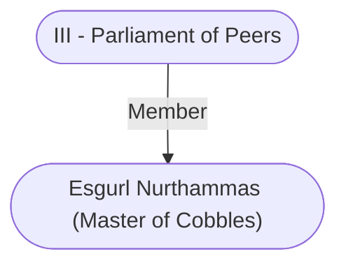

# Esgurl Nurthammas (Master of Cobbles)
## Overview
**Race**: Human
#Race/Human

**Gender**: Male
#Gender/Male

**Age**: Adult
#Age/Adult

The master of cobbles attends to road and bridge con struction and the maintenance of all public stonework that is not a city wall, a drain, or an underways The post can be a lucrative one, since crafters sniffing after city building contracts are always willing to spend gold to catch the master’s attention.

Esgurl Nurthammas is young, nervous, and eager to please. He belongs to one of the poorest patriar fami lies and hopes to parlay a good record as master of cobbles into a [[III - Parliament of Peers|Parliament of Peers]] seat.

---
## Connections

%%
links: [ [[ III - Parliament of Peers]] ]
%%

---
## Tags
#Import/Forgotten-Realms-Atlas

