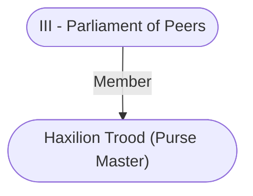

# Haxilion Trood (Purse Master)
## Overview
**Race**: Human
#Race/Human

**Gender**: Male
#Gender/Male

**Age**: Adult
#Age/Adult

**Class**: Commoner
#Class/Commoner

Purse Master in Baldur's Gate

## Profile
Haxilion Trood is a world-weary, jaded, cynical, sarcastic-to-the-point-of-cruelty, sour-faced, and sourthinking man. He never forgets a face or a detail, and his reputation for rudeness is born from his blunt, hon est-to-the-core observations.

The dukes unanimously appointed Trood as purse master. It is the hardest position to earn in [[1. Story World Almanac/Forgotten Realms/Toril/Faerun/1 - World Above/Baldur's Gate/Baldur's Gate|Baldur’s Gate]], because everyone in this merchant city has to trust the purse master with all the gold. The office’s record-keeping and bureaucracy are the most exten sive in the city. Purse Master Trood manages tax and toll collection and records; investment of city funds; and distribution of pay to all city offices and officials, including [[V - The Watch|the Watch]]. The purse master is also respon sible for ensuring that [[IV - The Flaming Fist|the Flaming Fist]] takes no more than its proper share of the taxes it collects.

Unsurprisingly, the purse master wields incred ible power, is hated by many, and is under constant scrutiny for signs of graft and Guild influence. Trood’s nonpartisan politics and integrity were the biggest fac tors leading to his appointment.

---
## Connections

%%
links: [ [[ III - Parliament of Peers]] ]
%%

---
## Tags
#Import/Forgotten-Realms-Atlas

