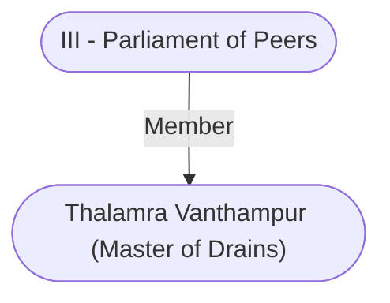

# Thalamra Vanthampur (Master of Drains)
## Overview
**Race**: Human
#Race/Human

**Gender**: Male
#Gender/Male

**Age**: Adult
#Age/Adult

**Class**: Commoner
#Class/Commoner

Master of Drains and Underways in Baldur's Gate.

## Story
Master Thalamra Vanthampur is an acid-tongued, shrewd, aggressive old woman, the matriarch of the Vanthampur family. Her office oversees all sewer, water pump, pipe, and cellar maintenance in the city.

Vanthampur’s post is at the same time one of the least and most desirable positions in [[1. Story World Almanac/Forgotten Realms/Toril/Faerun/1 - World Above/Baldur's Gate/Baldur's Gate|Baldur’s Gate]]. The tech nical nature of the office’s responsibilities place them beyond the understanding or inclination ofmost aris tocrats. The master of drains and underways, however, typically does very little work other than appointing knowledgeable underlings from the ranks ofher family to keep things running. Of course, ifthose subordinates fail in their duties, the repercussions could be disastrous.

---
## Connections

%%
links: [ [[ III - Parliament of Peers]] ]
%%

---
## Tags
#Import/Forgotten-Realms-Atlas

