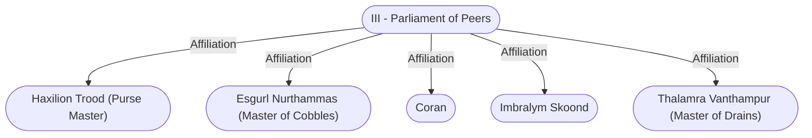

# III - Parliament of Peers
## Overview
**Type**: Government
#Organization/Government

**Government Role**: Leadership, Justice
#Government-Role/Leadership #Government-Role/Justice

**Government Organization**: Parliament
#Government-Organization/Parliament

## Profile
The Parliament of Peers consists of about fifty Baldurians, most ofwhom are patriars. A dozen or so powerful [[II - Lower City|Lower City]] representatives, including guild leaders and other wealthy individuals, are also peers. Only the least successful patriar families do not have at least one member among the peers. So far, parliamentary seats have been mostly hereditary. By unanimous decree, the peers have created and filled a few additional seats.

City law does not address how to fill these seats, so the peers do as they like. Parliament officially meets every day. Attendance is not mandatory, though, so only about twenty or thirty peers show up unless a session is scheduled on important political or monetary concerns. Although [[I - The Council of Four|the Council of Four]] officially controls the city, the Par liament of Peers first discusses and then recommends a course of action for virtually every city decision. In other words, every topic from toll rates to Flaming Fist contracts is argued on the floor of the parliament chamber in the [[High Hall (The Ducal Palace)|High Hall]].

---
## Governed Content
- [[Coran]]
- [[Imbralym Skoond]]

---
## Connections

%%
links: [ [[ Coran]], [[ Esgurl Nurthammas (Master of Cobbles)]], [[ Haxilion Trood (Purse Master)]], [[ Thalamra Vanthampur (Master of Drains)]], [[ Imbralym Skoond]] ]
%%

---
## Tags
#Import/Forgotten-Realms-Atlas

