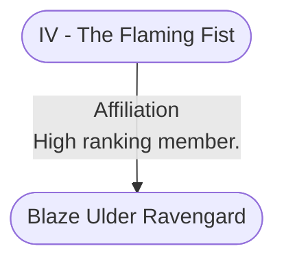

# IV - The Flaming Fist
## Overview
**Type**: Military
#Organization/Military

**Military Role**: Infantry, Support
#Military-Role/Infantry #Military-Role/Support

The Flaming Fist was founded in [[1. Story World Almanac/Forgotten Realms/Toril/Faerun/1 - World Above/Baldur's Gate/Baldur's Gate|Baldur’s Gate]] and has ever since been headquartered in the city. Since its inception under Grand Duke Eltan, the merce nary company has been tightly entwined with the city’s rulers, a connection that has become stronger in recent years.

## Profile
While [[V - The Watch|the Watch]] polices the [[I - Upper City|Upper City]]. the Flaming Fist watches over the [[II - Lower City|Lower City]]. The Fist has nominal authority over the [[III - Outer City|Outer City]], too, but its patrols are already hard-pressed to fulfill their duties in the [[II - Lower City|Lower City]] and on [[Wyrm's Rock|Wyrm’s Rock]], much less regulate the sprawl beyond the walls. Even though the organization hasnt grown as swiftly as the city’s population, the number of Fist mercenaries has tripled to six thousand since the company’s founding. Of that number, fewer than half are in the city at any time. The rest are stationed in fortifications elsewhere or are out on active campaign.

The Flaming Fist has prospered as the guardians of the city. [[I - The Council of Four|The Council of Four]] pays the group, and the Fist also receives a share of the taxes collected on goods and ships that enter the harbor and from people who use the Basilisk Gate or travel along [[IV - Wyrm's Crossing|Wyrm’s Crossing]].

Even though the Flaming Fist acts as the city’s army and [[II - Lower City|Lower City]] police force, [[1. Story World Almanac/Forgotten Realms/Toril/Faerun/1 - World Above/Baldur's Gate/Baldur's Gate|Baldur’s Gate]] remains stolidly neutral in external conflicts in which the Fist participates as one side’s hired muscle. Many people believe this stance is a ridiculous fiction, pointing out that the highest-ranking Flaming Fist officer is usually also a duke on [[I - The Council of Four|the Council of Four]], and that patriars earn profits from their mercenary-contract investments. But most Baldurian commoners view the separation of army and government with pride, and much ceremony is made when the city renews its con tract with the Flaming Fist.

Being in charge of both fortifications means that the Flaming Fist can control river traffic beading in either direction. Thus far, the company has not used its position to tax ships on the Chionthar that bypass the city. Since virtually all ships make a stop in the city, such measures have been unnecessary.

### Fortifications
The Flaming Fist builds or acquires fortifications in the theaters of war in which its soldiers operate. After a conflict, unless long-term economic or political rea Sons exist to maintain such outposts, the Flaming Fist abandons them to local control once its mercenaries have fulfilled their contracts.

Currently, Fort Beluarian is the only location the Flaming Fist permanently occupies outside [[1. Story World Almanac/Forgotten Realms/Toril/Faerun/1 - World Above/Baldur's Gate/Baldur's Gate|Baldur’s Gate]]. This trading outpost in Chult has fallen twice to Chultan attacks, claiming numerous lives and loss of capital each time. Regardless, money-hungry patriars are unwilling to abandon the settlement, thereby relin quishing the area’s trade opportunities.

In [[1. Story World Almanac/Forgotten Realms/Toril/Faerun/1 - World Above/Baldur's Gate/Baldur's Gate|Baldur’s Gate]]. the Flaming Fist occupies the [[II - Lower City|Lower City]]’s eastern and western walls as well as [[The Seatower of Balduran|the Seatower of Balduran]] and [[Wyrm's Rock|Wyrm’s Rock]]. The great granite edifice of the Seatower stands atop a rocky islet in the harbor, and a causeway links it to the western shore. The Flaming Fist uses the Seatower as a bar racks, a naval base, a prison, and a fortress. The Fist’s headquarters also boasts a full [[B9 - Armory|armory]] and tower-top trebuchets with which to battle hostile ships. A mas sive chain that stretches from the Seatower to pilings under the easternmost wharf in Brampton can be pulled taut at the water line to block invaders’ access to the harbor or prevent a ship from sailing out.

The Flaming Fist also controls [[Wyrm's Rock|Wyrm’s Rock]], a fortress that perches atop a towering stone jutting up midstream in the Chionthar River a short distance upriver from the city’s harbor. The structure occupies the entire island, leaving nowhere for an enemy to gain a foothold on the rock. The two spans of [[IV - Wyrm's Crossing|Wyrm’s Crossing]] connect [[Wyrm's Rock|Wyrm’s Rock]] to the river’s southern and northern shores.

### Members
Most Flaming Fist soldiers were raised in the [[II - Lower City|Lower City]] and [[III - Outer City|Outer City]] and were invited by a ranking officer to join the mercenary company. Others were once prisoners of war. The Flaming Fist holds no grudges, and defeated soldiers whose vanquished masters are unlikely to pay ransom for them often see the ben efit ofjoining the mercenaries. Some Fist recruits are adventurers who were passing through [[1. Story World Almanac/Forgotten Realms/Toril/Faerun/1 - World Above/Baldur's Gate/Baldur's Gate|Baldur’s Gate]] but hungered for a stretch of stable pay and steady work. Typically. adventurers’ varied experiences and skill with arms lead to quick promotions. Such heroes form the nexus of the Fist’s officer corps, but only those who have extensive battlefield experience reach its highest stations.

Beyond basic qualities ofcompetence and physi cal hardiness, prospective Flaming Fist members must show a capacity for strong loyalty and stronger morals. Discipline is important in a field soldier, but training can instill that. Otherwise, race, gender, and age matter little.

The Flaming Fist’s hierarchy is relatively simple. Only six ranks are recognized, including fist (private), gauntlet (corporal), manip (sergeant), flame (lieuten ant), blaze (major), and marshal (general). Ranks often have an attached title that describes a duty, such as fist sapper. a private who has expertise in siege demolition; blaze captain, a major who is also a ship’s captain; and flame jailer. a lieutenant who serves as captain of the guard in the Seatower’s dungeons.

The Fist does not house most of its soldiers. [[The Seatower of Balduran]] and [[Wyrm's Rock|Wyrm’s Rock]] have bar racks large enough to accommodate members of their permanent garrisons as well as new recruits who are undergoing training, but most Fist soldiers live in their own [[II - Lower City|Lower City]] apartments. The [[Seatower District|Seatower district]] has many inns that cater to the large number

---
## Governed Content
- [[Blaze Ulder Ravengard]]
- [[Favil Blanthe]]

---
## Connections

%%
links: [ [[ Blaze Ulder Ravengard]] ]
%%

---
## Tags
#Import/Forgotten-Realms-Atlas

