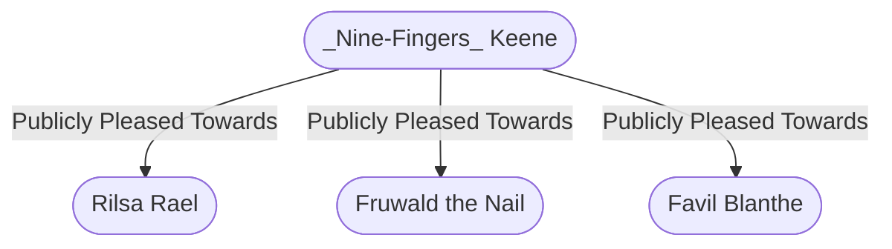

# "Nine-Fingers" Keene
## Overview
**Race**: Human
#Race/Human

**Gender**: Female
#Gender/Female

**Age**: Adult
#Age/Adult

### Portrait
![[nine.png|Portrait]]
[[nine.png|open outside]]

The current master of [[VI - The Guild|the Guild]] disdains flashy garb and appearance-improving magic, so the world sees her as she truly is—an unassuming, brunette woman of middling height and build. Neither plain nor beautiful, Nine-Fingers is completely indistinctive. Her forgettable looks, far from being a drawback, were a great asset during her years as a thief Nine-Fingers has a knack for avoiding attention. She drifts into and out of rooms, unregarded until she speaks. The guildmaster never forgets a face or a name, and she is a shrewd judge of people. Within minutes of meeting someone, she can correctly assess the person’s motives, ambitions, and fears and how far that individual can be trusted

## Story
Few people know her given name. To the Gate, she is simply the notorious “Nine-Fingers.” The story of her nickname and her rise would be a popular tavern tale if it were widely known. When Astele Keene was five years old, a one-eyed elfkidnapped her, sliced offthe little finger of her left hand, and sent the digit to her parents along with an exorbitant ransom demand. Little Astele’s parents borrowed the money from family and friends and bought back their daugh ter, but Nine-Fingers never forgave the elf—and never forgot his coppery hair and single eye.

Years later, when she was a rising Guild operator, she found her kidnap per in a pipe den, where he was feeding his sable Nine-Fingers Keene moonflower addiction. Nine-Fingers blinded his remaining eye and cut off all but the little fingers on both of his hands. She then bought the pipe den and instructed its proprietor to make sure the elf always has enough food, drink, and smoke to stay alive and maintain his addiction. The addict’s sable moonflower is laced with the dried yolk of cockatrice eggs, which Nine-Fingers procures at great expense, to transform his smoke dreams into nightmares. Because he’s an elf, Nine-Fingers expects her kidnapper to outlive her, so she has made advance payments to ensure that his tor ture endures throughout his natural life.

Nine-Fingers is now patient and calculating; the passion of her youth has faded. She seeks revenge for offenses against [[VI - The Guild|the Guild]] only when doing so will increase the cabal’s profits. A meticulous planner, Nine-Fingers anticipates treachery. She pits trouble some Guild members against each other to blunt any internal threats while simultaneously discouraging open bloodshed.

The guildmaster never goes anywhere without her personal bodyguards, whom the kingpins call the Lady’s Court. The six women—two wizards and four accomplished warrior-rogues—are utterly devoted to Nine-Fingers, and she lavishly rewards their loyalty. She prefers anonymity, so her bodyguards accompany her invisibly, sometimes in disguise and sometimes at a distance. When Nine-Fingers speaks with a kingpin, a patriar, or an underworld figure, she often appears to be alone, but she almost never is.

Under her guidance, [[VI - The Guild|the Guild]] has become an integral part of the city’s businesses and politics. It polices its own activities to minimize interference from [[IV - The Flaming Fist|the Flaming Fist]] and [[V - The Watch|the Watch]], and Guild enforcers keep unsanctioned crime to a minimum. Nine-Fingers has invested her substantial wealth (or the portion of it left over every month after she pays off politicians, patriars, judges, and officers) in numerous legitimate businesses. In a city full of spies and informants, her intelligence network is unequaled. Nine-Fingers can guarantee a majority of votes in the [[III - Parliament of Peers|Parliament of Peers]] on any subject, including the selection of a new duke. Her tools against [[VII - The Patriars|the patriars]] include coercion, manipulation, graft, and the threat of exposing their secrets, both true and false. The last thing Nine-Fingers wants is open confrontation with the Fist or [[VII - The Patriars|the patriars]], which would mean blood in the streets. Blood is hard to control and bad for everyone’s profit margins.

---
## Connections

%%
links: [ [[ Favil Blanthe]], [[ Fruwald the Nail]], [[ Rilsa Rael]] ]
%%

---
## Tags
#Import/Forgotten-Realms-Atlas

