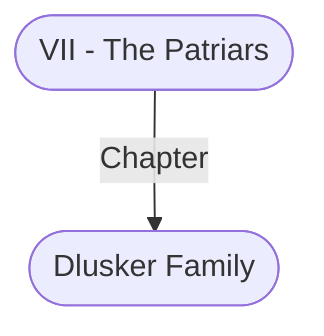

# Dlusker Family
## Overview
**Type**: Family
#Organization/Family

**Family Notability**: Politics, Military
#Family-Activity/Politics #Family-Activity/Military

Lord Norold Dlusker is caught in the middle of the growing tension in [[1. Story World Almanac/Forgotten Realms/Toril/Faerun/1 - World Above/Baldur's Gate/Baldur's Gate|Baldur’s Gate]]. He has ties to the peers, [[IV - The Flaming Fist|the Flaming Fist]], and [[VI - The Guild|the Guild]], but has the respect of none of them. Most patriars snub the Dlusker family because they were prominent support ers of Duke Valarken before the attempted coup.

That history only primed the pump for Norold Dlusker’s real troubles, however. After his older sister died mysteriously from mummy rot and her hus band, along w’ith the family’s fortune, disappeared in Waterdeep, Dlusker suddenly found himself the patriarch of an impoverished, disgraced family. He is deeply in debt; his meager income derives from sheep folds beyond the city, a [[II - Lower City|Lower City]] textile mill, and a handful of [[III - Outer City|Outer City]] slaughterhouses. Norold’s younger sister, Guinever, is the lord’s only heir. She is married to one of Wyllyck Caldwell’s Sons in an apparently happy union.

---
## Connections

%%
links: [ [[ VII - The Patriars]] ]
%%

---
## Tags
#Import/Forgotten-Realms-Atlas

