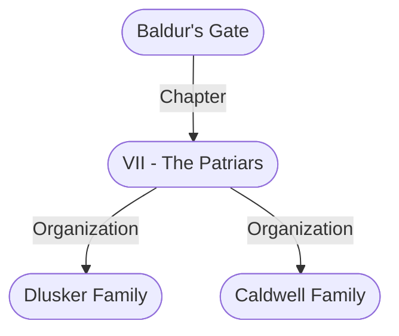

# VII - The Patriars
## Overview
Although heroics or wealth could once propel some one into the nobility’s ranks, nowadays ancestry and tradition define who is or is not a patriar. Today’s lords and ladies of [[1. Story World Almanac/Forgotten Realms/Toril/Faerun/1 - World Above/Baldur's Gate/Baldur's Gate|Baldur’s Gate]] are the descendants of the city’s earliest inhabitants.

Most reside in grand [[I - Upper City|Upper City]] manors that their families have lived in for generations. All such homes have beautifully maintained facades, even if a floundering family must strip its insides bare. No one among the gossipy patriars is fooled, but they all believe that keeping up appearances is a civic duty.

The upper crust’s social activities include gossiping; small contests of skill, such as board games or darts; an endless cycle of dances and revels; “enthusiasms,” such as creating collections or attending learned talks on various subjects; and gambling. Virtually all patri ars are compulsive bettors. They wager on races, such as those featuring snakes or weasels; fighting, includ ing arm wrestling, full-body wrestling, and matches between animals; and duels.

Two types of duels are legal, buff-pole and bluntsword contests. In the former, youths joust without saddles or reins, using blunted and padded buff-poles. In the latter, adults use blunted swords to score hits against their opponents while dueling in a small, bare room or enclosure. The victor is the opponent who scores the most hits. The duel begins when an unlit lantern filled with fireflies is opened and ends when the last firefly exits the lantern. w’hether that is seconds or hours later. Because of the duel’s random length, contestants have occasionally been beaten to death when their strength flagged and they collapsed during a long match against a ruthless opponent.

### Picture (Simple)
![[families.png|Picture (Simple)|300]]
[[families.png|open outside]]

---
## Governed Content
- [[Caldwell Family]]
- [[Dlusker Family]]

---
## Connections

%%
links: [ [[ Caldwell Family]], [[ 1. Story World Almanac/Forgotten Realms/Toril/Faerun/1 - World Above/Baldur's Gate/Baldur's Gate]], [[ Dlusker Family]] ]
%%

---
## Tags
#Import/Forgotten-Realms-Atlas

