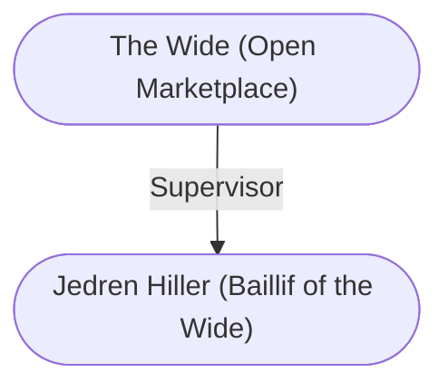

# The Wide (Open Marketplace)
## Overview
The Wide, a sprawling [[B7 - Marketplace|marketplace]], is the eponymous landmark of this [[I - Upper City|Upper City]] district. Its reputation as a thriving crossroads of trade spans The Sword Coast and stretches as far east as Thay. During the day, the steamy aroma of roasted, spiced meats mixes with the wet, earthy smell character istic of [[1. Story World Almanac/Forgotten Realms/Toril/Faerun/1 - World Above/Baldur's Gate/Baldur's Gate|Baldur’s Gate]]. Bright, multicolored awnings cover stalls in which tools, textiles, foods, luxuries, oddments, silks, scarves, tobacco, Shining South spices, and all manner of creature comforts from every corner of Faerfun are bought and sold.

Prices are lower in the Wide than else where in Baldur's Gate, which means negotiations are usually sharper. Not all merchants here are in the [[Commodities|commodities]] trade. Tattoo artists, fortune tellers, sages, hedge wizards, astrologers, and poets also work in the Wide. At tables throughout the market area, Baldurians mingle to debate city affairs, philosophize, gossip, and conduct business and trade. Meanwhile, strong, young delivery-makers bull through the shoulder-to-shoulder crowds heading to and from stalls. If not for the tall poles they wear strapped to their backs and shoulders, the goods carried by these young males and females would be easy targets. Atop the poles, out of a human-sized person’s reach, swivel and sway baskets and crates full ofgoods. Seldom do these top-heavy poles collide and become entangled. But when they do, a row inevitably ensues. As soon as pole-carters leave the open air ofthe Wide and enter less crowded city streets, they lower their merchandise to street level lest enterprising bandits lean out second-story windows to strip them of their wares.

The Wide is the city’s only large civic space and serves as its market. By law, all buying and selling in the city not completed in a licensed and taxed establishment must be done in the Wide. Sellers at the daily market set up their tables, accoutrements, and wares just after dawn. At dusk, [[V - The Watch|the Watch]] clears the streets of visitors and vendors. Decorum and order hold sway; street music and noisy activities are prohibited. This rule does not per tain on days when the dukes declare that the Wide be used for civic purposes and traditional market holidays, such as Highharvestide. At these times, vendors suited to the festivities set up on the Wide’s fringes while the area’s central expanse is given over to dances, contests, and games.

Most nights, the Wide is an empty space whose perimeter (and only that much) is illuminated by light from the buildings that ring it. A patriar sometimes schedules the space for an evening social event, such as a concert, a grand ball, or a wedding.

## Goods and Services
**Goods Sold**: Consumable Item, Food and Drink, Healing Item, Other, Weapon, Gear, Clothing, Protection, Accessory
#Goods-Type/Consumable-Item #Goods-Type/Food-and-Drink #Goods-Type/Healing-Item #Goods-Type/Other #Goods-Type/Weapon #Goods-Type/Gear #Goods-Type/Clothing #Goods-Type/Protection #Goods-Type/Accessory

**Services Sold**: Information, Entertainment, Commerce, Communication, Crafting, Food
#Service/Information #Service/Entertainment #Service/Commerce #Service/Communication #Service/Crafting #Service/Food

## Profile
**Prices**: Cheap
#Price/Cheap

**Quality**: Average
#Quality/Average

07:00-17:00

---
## Governed Content
- [[Jedren Hiller (Baillif of the Wide)]]
- [[The Beloved Ranger]]
- [[The Undercellar]]

---
## Connections

%%
links: [ [[ Jedren Hiller (Baillif of the Wide)]] ]
%%

---
## Tags
#Import/Forgotten-Realms-Atlas

