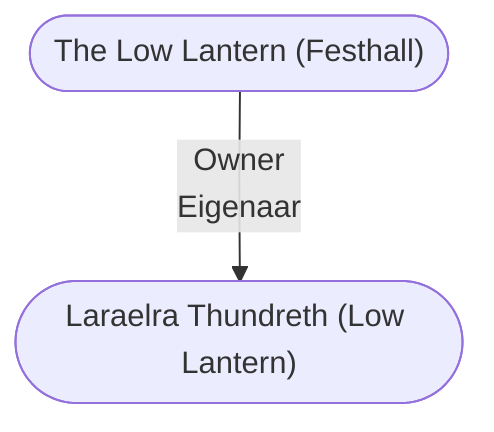

# The Low Lantern (Festhall)
## Overview
An aging, three-masted merchant ship rocks gently in the water alongside the Stormshore Street dock on the harbor’s east side. Ostensibly a festhall, a tavern, and a gambling house, the Low Lantern also serves as a place for covert meetings in which sensitive and illicit plans can be discussed without fear of eavesdroppers.

## Goods and Services
**Goods Sold**: Food and Drink
#Goods-Type/Food-and-Drink

**Services Sold**: Information, Entertainment, Food
#Service/Information #Service/Entertainment #Service/Food

Liar's Dice (gambling)

## Profile
**Prices**: Average
#Price/Average

**Quality**: Poor
#Quality/Poor

20:00-06:00

Owner: The “Lady Captain” [[Laraelra Thundreth (Low Lantern)|Laraelra Thundreth]]

## Story
The open upper deck is a place of hanging lamps, genteel repartee, smoking, and drinking. All the wilder goings-on at the place normally happen belowdecks, but special parties can be arranged to take place in the rig ging and sail booms for those who are willing to brave the heights and able to pay the high fee. Most patrons arrive armed, and rowdiness is common, but the Low Lantern’s ex-pirate “crew” moves quickly to quell large brawls and prevent fires.

The “Lady Captain” [[Laraelra Thundreth (Low Lantern)|Laraelra Thundreth]]—a gambler, a sorcerer, and a secret Guild member—owns the oft leaking and hastily repaired vessel.

---
## Governed Content
- [[Laraelra Thundreth (Low Lantern)]]

---
## Connections

%%
links: [ [[ Laraelra Thundreth (Low Lantern)]] ]
%%

---
## Tags
#Import/Forgotten-Realms-Atlas

