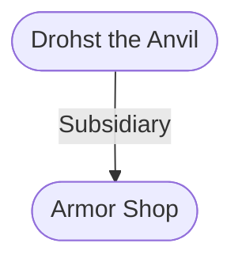

# Armor Shop
## Goods and Services
**Goods Sold**: Protection, Armor ; This shop sells items at a normal cost.
#Goods-Type/Protection #Goods-Type/Armor

For Sale: Armor
For Sale: Blacksmith

### Picture (Simple)
![[z_Assets/zz_asset-files 1/h0xaabvu.gg4.png|Picture (Simple)|300]]
[[z_Assets/zz_asset-files 1/h0xaabvu.gg4.png|open outside]]

### Picture (Simple)
![[z_Assets/zz_asset-files 1/eell2euq.gkk.png|Picture (Simple)|300]]
[[z_Assets/zz_asset-files 1/eell2euq.gkk.png|open outside]]

---
## Governed Content
- [[Drohst the Anvil]]

---
## Connections

%%
links: [ [[ Drohst the Anvil]] ]
%%

---
## Tags
#Import/Forgotten-Realms-Atlas #Source-Books/Princes-of-the-Apocalypse

