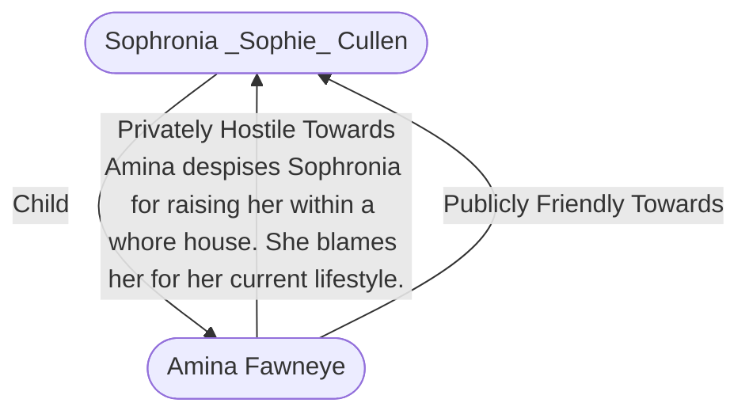

# Amina Fawneye
## Overview
**Alignment**: Neutral
#Alignment/Neutral

**Race**: Human
#Race/Human

**Gender**: Female
#Gender/Female

**Age**: Adult
#Age/Adult

**Class**: Commoner
#Class/Commoner

**Character Role**: Neutral
#Character-Role/Neutral

### Portrait
![[zuuq3b3d.hkz.png|Portrait|300]]
[[zuuq3b3d.hkz.png|open outside]]

Amina Fawneye

Social Chameleon

*“That necklace she wears? See how beautifully it catches the light? It will be mine.”*

**Appearance:** Her large, innocent-looking eyes project integrity and honesty.

**Roleplaying:** She will say or do whatever it takes to build trust in her target.

**Personality:** She doesn’t care for others; they exist to be manipulated.

**Motivation:** Amina gets her thrills from both a successful theft and the pretty baubles that are her reward.

**Background:** Born into a moderately wealthy merchant family, Amina always appreciated the pretty trinkets her father brought home from his travels. When her father’s return trips became less and less frequent and the flow of gifts halted altogether, Amina decided to steal them for herself. When she was caught trying to steal from one of her father’s clients—a scandal that nearly destroyed the family business—she was disowned, and she’s been working the streets ever since. She’s quite stealthy, and competent with traps and locks, but her real talent is her social grace. A natural chameleon, she’s able to blend into nearly any situation and expertly manipulate others. She could go far in politics, espionage, or business, but Amina doesn’t want success or money. She’s content with her modest lifestyle, but occasionally will fixate on a piece of jewelry and use her considerable abilities to take it. Afraid that selling her trophies will get her caught,

she either melts them down or keeps them well-hidden. She only wears them in private.

**Traits:** *(KS) Charming, criminal, stealthy*

---
## Connections

%%
links: [ [[ Sophronia _Sophie_ Cullen]] ]
%%

---
## Tags
#Import/Forgotten-Realms-Atlas #Utility/Empty #Source-Books/Princes-of-the-Apocalypse

