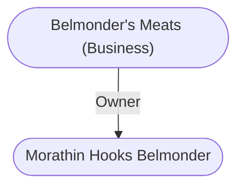

# Belmonder's Meats (Business)
## Overview
This shop is always busy. From when the place opens at dawn to when it closes at dusk, the four counter clerks and five butchers here are kept hopping chopping and wrapping meat for all theyre worth to satisfy the endless lines of customers crowding in for fresh meat. By far the most popular meat counter in the city; Belmonders has two side counters: one sells skewers of sizzle-cooked meat scraps (a popular walking meal for those one the go) and the other sells whole sides of meat to buyers for inns, other eateries, noble families, and wealthy folk. At night, a security force of 20 experienced and well-equipped hireswords guards the unloading of meat wagons. A meat wagon arriving in the city is escorted to a warehouse by a city watch patrol and/or a member of the [[Guild of Butchers]]. The night runs from warehouses to the various butcher shops have similar escorts.

There are tales of corpses found hanging on hooks in the ice chambers here and murdered men delivered packed in the wagons with the other meat under the ice and straw, but the throngs of shoppers love the place and have never been put off by such outrageous whispers. Smoked and well-aged sides are brought in from Belmonders own estates northeast of the city near [[Rassalantar]]. The butchers will also cut up a carcass for you if you bring one in. This task takes about 20 minutes and costs 3-10 gp, depending on the size and difficulty of the job.25

**Proprietor:** The proprietor, [[Morathin Hooks Belmonder]], is a burly hearty man with a strong stomach and a good eye for meat. He is Second Knife of, and public contact for, the [[Guild of Butchers]].

### Smart Image (Map)
![[Shop.png|Smart Image (Map)|300]]
[[Shop.png|open outside]]

---
## Connections

%%
links: [ [[ Morathin Hooks Belmonder]] ]
%%

---
## Tags
#Utility/Empty #Import/Forgotten-Realms-Atlas

