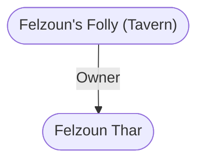

# Felzoun's Folly (Tavern)
## Overview
This many-windowed tavern is a noisy crowded, casual place, where many merchants and shoppers grab a quick tankard and a bite. Its exterior presents an awning-festooned, three-story face on the northwestern corner where the mouth of River Square opens into Salabar Street.

A bite here means a sausage roll or chicken-and-cheese pasty augmented by fresh asparagus with melted butter (when in season) or fresh whole oysters. Those with strong stomachs eat oysters raw here by tradition. The standard fare costs 4 sp eacha real bargain. The seasonal delicacies are 6 sp/plate.

Theres little variety in drink here. Ale is 1 sp/tankard, stout is 2 sp, and wine and zzar are both 4 sp/tallglass. There are usually six white wines to be had, including sweet [[Neverwinter]] Nectar, and three reds. Ive heard rumors that stolen goods can be fenced here, but could learn nothing more.33 In all the din and confusion, I suspect wholesale wars could be fought here, with no one the wiser!

## Goods and Services
**Goods Sold**: Food and Drink
#Goods-Type/Food-and-Drink

**Services Sold**: Food
#Service/Food

Ale is 1 sp/tankard, stout is 2 sp, and wine and zzar are both 4 sp/tallglass. There are usually six white wines to be had, including sweet [[Neverwinter]] Nectar, and three reds.

## Relationships
**Proprietor:** [[Felzoun Thar]], the bristle-bearded, fearless dwarven host, is always bustling busily about the Folly.

---
## Connections

%%
links: [ [[ Felzoun Thar]] ]
%%

---
## Tags
#Utility/Empty #Import/Forgotten-Realms-Atlas

