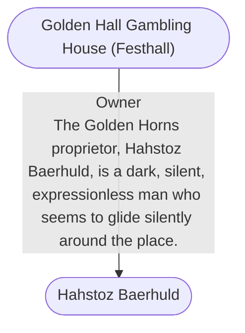

# Golden Hall Gambling House (Festhall)
## Overview
This ornately gilded palace of gleaming black polished marble stands on the east side of Snail Street, dominating the curve where it sweeps sharply east near its northern end.26

I could barely see inside this placeand what I could see was red and plush: red carpet, red sofas, red cushions, dancing girls wearing sheer red silk gowns (that were high cut and low cut!), and even a red-painted ceiling.

The lamplight is kept dim, I suspect, to hide as much of the cheating from the customers as possible. If any notice and object, the 16 bodyguards in the place converge like thirsty stirges, and the disturbance is quickly and quietly removed.

 My advice to those who dont enjoy losing great sums of money is to stick to the four-hand card and dice games where you play against the house and three other patrons. And try to find out early on which one of the other patrons is the house antic (undercover agent)! Its worth one visit, just to be overwhelmed by all the red cozinessand to see the sensual dancing.

 If you do win big once a year or so someone does, Im told youll have the mystery contents of the golden horn, which hangs above the huge open hearth, added to your winnings. But be careful: I expect the horn holds coins treated with a slow-acting paralyzing agent or a polymorphed monster, so these folks can quietly get their money back!

## Relationships
**Proprietor:** The Golden Horns proprietor, [[Hahstoz Baerhuld]], is a dark, silent, expressionless man who seems to glide silently around the place.

---
## Connections

%%
links: [ [[ Hahstoz Baerhuld]] ]
%%

---
## Tags
#Utility/Empty #Import/Forgotten-Realms-Atlas

