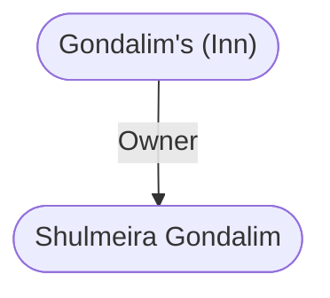

# Gondalim's (Inn)
## Overview
This large, comfortable old inn stands in the angle where Winter Path and Burnt Wagon Way both meet with the [[High Road]]. Its a worn but comfortable place, and because of its massive construction, its also very quiet. Youll seldom hear noises from other guests at night.

Rooms vary from 2-7 gp/night, depending on the size and amenities. The top-priced rooms are actually large suites, sleeping up to 10 people in comfort. In all cases, stabling and dawnfryor morningfeast, as they call it more formally hereare included. In all, it is a nice place to stay and very central.

When crossing the lobby between the room stairs and the dining room, observant visitors may see a dark stain on the door leading to the kitchensas if something spattered against it just above halfway up and ran down it to the floor. The stain isnt poor housekeeping. Some 70 winters ago, the princess Shaerglynda of Tethyr was murdered on that spot.

She died from a swordthrust that pinned her to the doorand the dark stain was left by her lifes blood. It cant be cleaned away and it never fades or disappears. Even when the door is replacedand it has been, at least twicethe bloodstain slowly reappears by itself.

> [!quote] Callout
> Elminster confirms that the bloodstain tale is true.
> 

## Relationships
**Proprietress:** [[Shulmeira Gondalim]] is the proprietress. She is the granddaughter of the founder. She is a short, slim, unspectacular but charming woman of young age. She presides with quiet expertise over a staff of old, large, stoop-shouldered and shuffling, but calmly capable, servant women.

---
## Connections

%%
links: [ [[ Shulmeira Gondalim]] ]
%%

---
## Tags
#Utility/Empty #Import/Forgotten-Realms-Atlas

