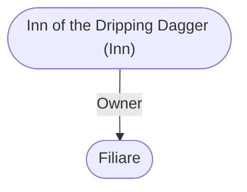

# Inn of the Dripping Dagger (Inn)
## Overview
### Smart Image (Map)

```leaflet
id: Smart Image (Map)
image: [[Volo 5292.PNG]]
height: 427.4px
draw: false
showAllMarkers: true
preserveAspect: true
bounds:
    - [0, 0]
    - [213.7, 300.0]
marker: default, 112.0, 204.5,[[Mahir's Tower (Wizard Domicile)]]
marker: default, 82.8, 136.2,[[Myrmith Splendon (House)]]
marker: default, 189.9, 58.3,[[Inn of the Dripping Dagger (Inn)]]
marker: default, 156.3, 50.8,[[The Riven Shield Shop (Business)]]
```
[[Volo 5292.PNG|open outside]]

This cozy old inn stands on the east side of the [[High Road]], south of Selduth Street and north of the Coffinmarch.20 Its wellknown as the favorite watering hole and resting place for hireswords, and has a reputation for jovial horseplay that keeps the more timid merchants and pilgrims away from its doors.

**The Place:**
This tavern has a fieldstone street-level floor pierced by a few squat, iron-barred arched windows. A row of iron and amberglass lamps run along its front, illuminating the hanging dripping dagger signboard and the entry door, which is covered with many bloodstains and weapon scars. The owner used to leave all the weapons that had sunk into it in place as grisly bristling adornment, but they started proving too handy for those wishing to snatch up a weapon and work a little mayhem, and the city watch asked him to remove them.

The timber upper floors have necessitated a no smoking/no fires rule except in the taproom. They contain two floors of comfortable rooms, an attic with a secret closet for hiding incriminating things (such as bodies) from the city watch, and a flat roof with several carved stone griffons on it, which serve to give pigeons something to adorn and people using the roof to look for the watch or just to enjoy the city view something to lean against. If folk visiting the Dripping Dagger use aerial steeds, the griffons have rings set into them for the easy tethering of mounts.

There is a stable behind and a little south of the inn reached by a passage off Spindle Street, and a few gnarled old trees that one can relax under. This back alley is frequently full of fighting men at practice.

**The Prospect:**
Inside, the inn has a dark, lowceilinged taproom like many a tavern. A stair beside the bar leads up to the inn rooms, and there is a private dining room around behind the stairs that has been used for many war councils and private business meetings down through the years.

The place is simple, but comfortably furnished and welcoming. The warrior guests seem to relax completely here, and laugh, joke, and play at dice, cards, or board games with easy, lazy enjoyment. Songs and play-acting, wherein one hairy warrior gets up and lisps and flirts his way through an imitation of a noble lady or mimics a pompous merchant met during the day, are common.

Laughter rings often around this taproom. I can see why guests love this place so and become regulars. Those who are not fighting men are greeted affably and treated with courtesy rather than being made to feel unwelcome or out of place. On my first visit, I saw three hulking mercenaries on their knees on the floor solemnly playing orc squash with a little boy as his mother looked on in pleased amazement.

### Dripping Dagger (Map)
![[4saoflda.dbl.png|Dripping Dagger (Map)|300]]
[[4saoflda.dbl.png|open outside]]

**The Provender:** The menu at the Dripping Dagger is typical for a good inn, and Ive reproduced it in full here (page 113). I would hope that those planning to open their own establishments elsewhere will take their measure of its simple breadth and prices!

### Dripping Dagger (Menu)
![[zp0wplga.cat.png|Dripping Dagger (Menu)|300]]
[[zp0wplga.cat.png|open outside]]

**The People:**

The proprietor is [[Filiare]], a jovial, middle-aged ex-mercenary whos Blazidon One-Eyes chief competitor in the business of getting mercenaries hired. Many folk come here seeking hireswords in a hurry and [[Filiare]] is known to all and trusted by most. He has lots of spare weapons and gear given to him by fighting men who never came back or who paid him in goods when they lacked coin, which he will sell or rent to adventurers. He has also known to trim his prices a bit for guests thin in the purse.

[[Filiare]] presides over a staff of four waitresses, four chambermaids, six kitchenfolk, and four hostlers (in the stable behind).

## Profile
**Prices:** Food prices are as given on the menu. A room rents for 5 sp/day from highsun to highsun, with stabling included, or 20 sp/tenday. Bedroll (bunking on the floor of the attic with others) is 1 sp/night. A bowl of soup, a mug of ale, and a round loaf of bread are included with bedroll service.

## Background
**Travelers' Lore:** Many famous mercenaries and companies have stayed here while in [[Waterdeep]]. By common consent, the inn is neutral ground where rivals and sworn enemies stay amicablyor at least tolerantlytogether. Before they built their own keep (since destroyed), the Company of Crazed Venturers lived here, and it was always their favorite place to drink. Longtime regulars still talk about the time they used a wish spell to teleport back from disaster in a nearby dungeon and shattered the bar with their arrival. Unfortunately they appeared without any of their equipmentand closely followed by their teleporting foes! (If you should meet with a former member of the Company this is not a good topic to discuss.)

Many other tales are linked to the Dripping Dagger, but Ill tell only one other. Alusair Nacacia, princess of Cormyr, when still a slip of a girl, gave her lady attendants and guards the slip while her father was meeting with Piergeiron. She wandered in here and was happily playing with the warriors in the taproom while the city watch and city guard were frantically turning the city upside down searching for her and dreading having to report her disappearance to Khelben to get magical aid in tracing her whereupon her father was sure to hear of her disappearance. After the Daggers patrons had mock-wrestled with her, tossed her from hand to hand until she was quite winded, let her sip strong things that shed always been forbidden to taste, and disarmed her and showed her how to do it to someone else, they were in the midst of showing her how to throw daggers when the city watch came in. Its a good thing the watchs lead officer was swift - Alusair had just flung a dagger at the battered inside of the front door when he opened it. The most astonishing thing, he remarked later, was that no one in the Dagger knew that she was a princess.

Her fathers later dry comment was that the most astonishing thing (to him) was the number of unsuitable jokes and sayings shed learned in a brief hour or so. Her lifelong habit of muttering "Stop me vitals!" under her breath comes from this childhood visit to the Inn of the Dripping Dagger. When she turned up missing much later in life, the first place Cormyrean agents in [[Waterdeep]] were ordered to check was (of course) the Inn of the Dripping Dagger.

### Dripping Dagger (Pic)
![[vfa11d5e.jsh.png|Dripping Dagger (Pic)|300]]
[[vfa11d5e.jsh.png|open outside]]

---
## Connections

%%
links: [ [[ Filiare]] ]
%%


---
## Tags
#Utility/Empty #Import/Forgotten-Realms-Atlas

