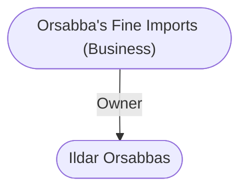

# Orsabba's Fine Imports (Business)
## Overview
Here you can pay far too much money for things you never expected to see on sale in a shop things from far away in [[1. Story World Almanac/Forgotten Realms/Toril/Faerun/1 - World Above/Faerun]]. This shop caters to the homesick, with perfumed hangings from Calimshan, a spear from Tethyr adorned with the skull of a royal family member, rock rubble from [[Mirabar]], and much, much more.

Nobles needing costumes for feasts often come here to rent or buy authentic pirate garb from the Sea of Fallen Stars, barbarian furs from the far, frozen North, silken robes from Thay, and even Bedine robes and headgarb from the depths of [[1. Story World Almanac/Forgotten Realms/Toril/Faerun/1 - World Above/Anauroch]]. Others come for disguises.

This shop, on Vellarrs Lane just east of the Street of the Tusks,28 is entered up a steep flight of stone steps. The main floor of the shop, a dozen feet above the street, is adorned with a large, arched window inset with a border of varicolored glass. At night, it glows slightly due to powerful spells on it that deflect all missiles and blows, preventing its breakage.

Inside, the observant visitor will notice a curious sight on the windowsill: a scattering of small, knobby bones, yellowed with age. They are a legacy of [[Waterdeep|Waterdeeps]] more lawless days, when most thieves snatched by night, rather than wore guild livery and stole by contract and moneylending.

There was a scything blade trap built into the sill of this window. The trap may still function when set. The present proprietor will not say though he will talk about the bones.

The windows excellent location as a means of entry resulted in more than one late-night scream. On many a morning, the shopkeeper would get up, draw his sword, go downstairs to unset the trap, and open the window only to find the remnants of an unlucky or unskilled thiefs hand there on the sill.

Orsabbas fills special orders (where customers request specific items from certain places), but the fees are steep, and the wait may be long as long as an entire season in some cases.

## Relationships
**Proprietor:** [[Ildar Orsabbas]] (the [[Ildar Orsabbas|Duke of Darkness]]) is the proprietor. His nickname comes from the masked, sinister guise he wears to nobles feasts.

---
## Connections

%%
links: [ [[ Ildar Orsabbas]] ]
%%

---
## Tags
#Utility/Empty #Import/Forgotten-Realms-Atlas

