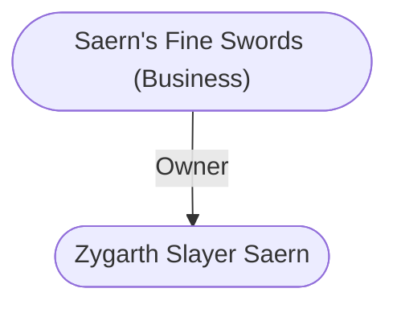

# Saern's Fine Swords (Business)
## Overview
This shop stands on the southeastern corner of the meeting of the [[High Road]] and Burnt Wagon Way.31 Its an old, massively built stone place with bars on all the windows, crenelations on the flagstone roof, and a narrow exposed, iron-bound door overlooked by arrow slitsin short, a miniature fortress.

It holds a large stock of swords, including a few made by Szwarharba the Swordsmith, the famous craftsman of Tethyr, who before his death some 90 winters back had learned how to forge blades that could be bent around almost in a circle without breaking or becoming permanently angled out of true. Swords are not made to fit the user here, but they are sharpened (including overall lightening by shaving the blade thickness). The large selection means that most shoppers will be able to find a sword that is reasonably suitable to their reach and strength. A good long sword costs about 20 gp, including the 1 gp city fee, and a fine dagger about 4 gp.

Piergeiron has a deal with the proprietor of this shop: Should the city militia ever need to be called up quickly and reinforced with volunteers needing arms, the city guard will empty the shop of arms, take it over as a rallying post, and pay the owner (who will be allowed to stay in residence with his staff if he desires) 90,000 pieces of gold on the spot.

Few clients know the quietly polite owner of the shop is a warrior, and fewer still know he has invisible weapons stashed all over the shop in plain view ready to defend himself with. One is a sword of dancing and another is a sword +4, defender. The shop has at least three staff on duty at all timesone of whom is an outof- uniform city guard officer, who notes the names and descriptions of those who buy particular weapons.

## Relationships
**Proprietor:** [[Zygarth Slayer Saern]] runs Saern's Fine Swords. He is a tall, gaunt, smiling man who can tell the age, quality, and condition of steel at a glance.

---
## Connections

%%
links: [ [[ Zygarth Slayer Saern]] ]
%%

---
## Tags
#Utility/Empty #Import/Forgotten-Realms-Atlas

