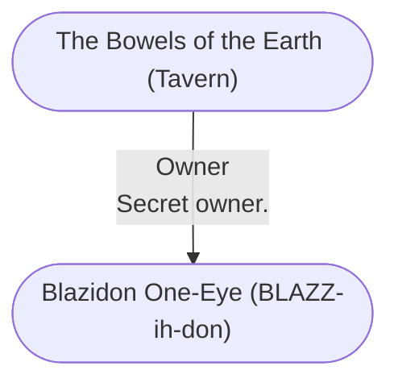

# The Bowels of the Earth (Tavern)
## Overview
### Virgin's Square (Map)

```leaflet
id: Virgin's Square (Map)
image: [[Volo 5291.PNG]]
height: 569.8px
draw: false
showAllMarkers: true
preserveAspect: true
bounds:
    - [0, 0]
    - [284.9, 400.0]
marker: default, 243.6, 67.0,,unknown
marker: default, 72.9, 33.7,[[The Bowels of the Earth (Tavern)]]
marker: default, 107.7, 306.6,[[Dulgen's Pipes Shop (Business)]]
marker: default, 232.9, 330.7,[[Blaskos' Fine Carving (Business)]]
```
[[Volo 5291.PNG|open outside]]

*Tavern (Dive) (4c•2p). An ill-lit rough-and-tumble tavern that caters to mercenaries looking for employment or a good brawl. ([[Blazidon One-Eye (BLAZZ-ih-don)|Blazidon One-Eye]] can oft be found here.)*

This rough, rowdy tavern stands on the southeast corner of the intersection of Snail Street and Simples Street, just west of Virgins Square.16 It is a cheap but cozy dive popular with mercenaries and adventurers. If youre a mercenary or an adventurer or are looking to meet or hire one or the other, you must go to this placeif youre male, that is, and look like youd be trouble for someone in a fight. Lady adventurers are usually bold enough to go inbut they sometimes have to empty the place with their fists or spells to win the respect they need to stay and enjoy themselves untroubled!

The Bowels is an old stone building that leans noticeably to the north into Simples Street. The windows are covered with stout wooden shutters, barred from within, because they long ago lost all their glass and screens. The tavern fronts on Snail Street, where its hanging signboard vividly depicts a pile of manure transfixed by a spade. Local children and drovers alike play an old, old game by flinging spadefuls and handfuls of dung at the sign, trying to make it stick to where the pile is painted.

### The Bowels of the Earth (Pic)
![[dosza2bo.p2i.png|The Bowels of the Earth (Pic)|300]]
[[dosza2bo.p2i.png|open outside]]

### The Bowels of the Earth (Pic)
![[55puqggx.sbx.png|The Bowels of the Earth (Pic)|300]]
[[55puqggx.sbx.png|open outside]]

**The Prospect:** Inside, the Bowels of the Earth is chiefly memorable for being dark. Hooded candlelamps at each table provide the only illumination. Its easy to imagine a blade being drawn in stealthy silence and sliding in and out of a mans ribs without warning until he crashes forward onto his tableand Im sure its happened here a time or two. The place is a haunt of the Shadow Thieves, its said, the place where the thief Moriath of the Company of Crazed Venturers met his end at their hands.17

There are several private, rentable rooms off the taproom. They are Spartan cubicles furnished only with lamps hanging on chains above built-in benches and tables. Behind the bar are the kitchens, and beside it is a door leading to the alley behind the tavern. Stairs lead up to a cesspit/ jakes at the back of the place, a set of former bedrooms crammed with stores, and a dustfilled attic. Stairs behind the bar lead down to a low-ceilinged cellar crowded with kegs as tall as a man and about as fat around as any four men. Even before you find the trapdoor behind them, you can smell that this place is connected to the sewers.

So why do adventurers, who can often afford better, come to this dump? Well, the prices are low well-banked fires keep it warm in winter, and in the close darkness there are always tales being told back and forthtales of taming and flying dragons, of hewing liches and baatezu limb from limb, and withstanding the hurled magic of archmages or beholders. The listener can visit far, exotic corners of Torilfrom fabled Evermeet to the chill ice of the Great Glacier, and from the depths of the Deep Realm of the dwarves to the unrelenting heat of [[Zakhara]], the Land of Fate without ever leaving the safety of his or her chair.

But more importantly than that, listening quietly and perhaps smoking in the darkness are usually one or more who have come to hire adventurers or simply mercenary swords for a task. They sit, and listen, take their measure of the speaker, and may lay down a coin for a hiresword to take up and so enter their service.

**The Provender:** Food in the Bowels is simple fare: coarse, rich dark rye bread in circular loaves, served to accompany slabs of cheese, sausage, and fowl pate. Theres also soup usually a thick concoction of peas and lentils simmered with all the meat scraps, fat, and bones that have come within reach of the place.

To wash all that down, theres lots to drinkin quantity. The selection isnt great. All that burns going down and isnt well thought of can be had, but if you want fancy wines, walk elsewhere.

**The People:** Regular patrons are hard to recognize in the darkness which is just as well for the city guard undercover agent whos usually listening here or for Mirt the Moneylender, the colorful and stout ex-mercenary.18 The bald-headed proprietor wears a gold earring and is almost as wide as he is tall (in other words, about five feet in each direction). His biceps are as large around as a fat mans thigh! This gentle giant is capable of snatching an unruly guest off his feet one-handed and hurling him across the taproom to strike the door so hard that it flies open and he sails out a good 10 feet into the streetand bounces. No wild taleI saw this myself. This bartender, Ongamar Talthloon, is (thankfully!) slow to anger.

**The Prices:** Drink goes by the tankard: 1 copper for rough ale, 3 coppers for good ale, 7 cp for zzar, and 1 sp to 6 sp for wine and spirits, depending on quality. A plate of food is 1 cp. A bowl of soup is 1 cp, but free with a plate of food.

**Travelers****' Lore:** The Bowels of the Earth has so many tales connected to it that I could fill another book this size, but theres one that every traveler finds interesting:

> [!warning] Message
> The tavern has been owned by more than one wizard in the past and its said in the city that theres still magical treasure hidden in the place somewhere. Many folk have stealthily cast detection spells only to find that the entire place radiates strong magical auraslayer upon layer, so that a dispel magic doesnt clear things! So far, only one magical ring has been found in the bottom of one of the wine kegs, when it rotted through.19
> 

> [!quote] Callout
> 18You wont find Mirt, or Khelben Blackstaff Arunsun either, for that matter, in the Folk of [[Waterdeep]] appendix at the back of this book. Elminster refused to say anything about either of them. He did say something like, The safety of all the Realms is too important to jeopardize just to sate thy curiosity.
> 
> 19Try chipping into the stone roof pillars that hold up the ceilings in the taproom and cellar, Elminster advised sarcastically with a grin. Just one small matter, he added: Remember that theyre holding the place up, and youre in it! Oh, another warning: The pillars reflect back all magic cast at them, 100% on the source.
> 

---
## Connections

%%
links: [ [[ Blazidon One-Eye (BLAZZ-ih-don)]] ]
%%


---
## Tags
#Utility/Empty #Import/Forgotten-Realms-Atlas

