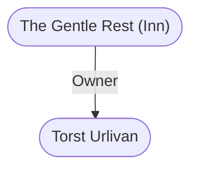

# The Gentle Rest (Inn)
## Overview
As a rule, a traveler spends more than one might expect to be at the center of it all in when taking accommodation in [[Waterdeep]] [[Trades Ward]]. This inn is by no means an exception to that practical expectation.

Located on the north side of the [[High Road]], just west of where it begins to bend westwards to meet [[Waterdeep]] Way, this inn rises five full floors above the street. It is large and well-appointed. 34 And for the money being asked, it should bethe rate is 6 gp/room per night!

No meals are included, but theres house wine and hot water for baths. A copper sitting-tub is provided in each room, as well as anoisy!stoppered floor drain. Well-tended tabling is also part of the room fee.

## Goods and Services
**Goods Sold**: Food and Drink
#Goods-Type/Food-and-Drink

**Services Sold**: Lodging
#Service/Lodging

## Relationships
**Proprietor:** [[Torst Urlivan]], the proprietor, is a tall, withdrawn, dignified man who dresses as if he were the wealthiest noble, but smells strongly of horse.

---
## Connections

%%
links: [ [[ Torst Urlivan]] ]
%%

---
## Tags
#Utility/Empty #Import/Forgotten-Realms-Atlas

