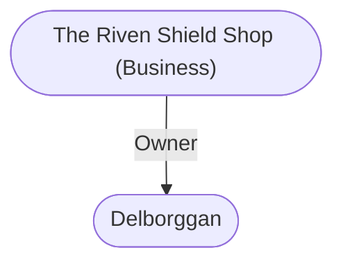

# The Riven Shield Shop (Business)
## Overview
This shop is famous up and down the Sword Coast for its large and varied assortment of secondhand arms and armor including many famous relics of fallen or retired adventurers. The most famous items are either not for sale, or command very high prices (thousands of gold pieces). There are, however, many serviceable, unhistoried used weapons here, from tiny daggers used by noble ladies to the heavy broadswords favored by barbarians, that are useful to anyone in need of a weapon. Scores of these sell each day.30

No one is tempted to steal the more valuable pieces. It is widely known that some of the magical shields hanging from the rafter beams contain magically imprisoned monsters that can be released to fight as an ally of the shield-wearer. It is also well known that one of the items in the shop (no one is quite sure which one, and the proprietor neglects to say) is an alert, always vigilant, sentinel.

### Smart Image (Map)

```leaflet
id: Smart Image (Map)
image: [[Volo 5292.PNG]]
height: 427.4px
draw: false
showAllMarkers: true
preserveAspect: true
bounds:
    - [0, 0]
    - [213.7, 300.0]
marker: default, 112.0, 204.5,[[Mahir's Tower (Wizard Domicile)]]
marker: default, 82.8, 136.2,[[Myrmith Splendon (House)]]
marker: default, 189.9, 58.3,[[Inn of the Dripping Dagger (Inn)]]
```
[[Volo 5292.PNG|open outside]]

> [!quote] Callout
> 30Location #169 on the color map. Currently, the shop holds such wonders as the Horrible Hammer of War (functions like a vampiric ring of regeneration); the Spear of Lochal, which has some strange magical powers and is believed to be only a part of a larger, more powerful magic item; the Helm of Bolarr, which allows its wearer to see even in pitch darkness and with infravision and to perceive any foe struck by the helm-wearer within the last turn, who is still within 400 yards of the helm, even if the foe is invisible, disguised by magic, has changed form, or is hidden behind a solid barrier; the Shield of Many Meteors, which attracts and harmlessly absorbs all fireballs, minute meteors, and similar fire magic effects into itself); and many others. The Horrible Hammer of War was wielded by the half-ogre Klarargh Skullbold, leader of the adventuring band known as Wrath Rampant, until he was slain by the city guard while trying to set fire to a tavern in [[Dock Ward]].
> 

## Relationships
**Proprietor:** [[Delborggan]] [[Delborggan|the Blade]] runs the Riven Shield Shop. He is a grizzled, one-eyed exadventurer.

---
## Connections

%%
links: [ [[ Delborggan]] ]
%%


---
## Tags
#Utility/Empty #Import/Forgotten-Realms-Atlas

