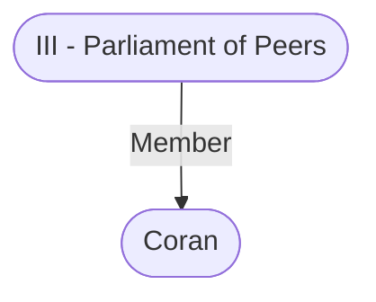

# Coran
## Overview
**Race**: Elf
#Race/Elf

**Gender**: Male
#Gender/Male

**Age**: Adult
#Age/Adult

**Class**: Commoner
#Class/Commoner

### Coran
![[coran.png|Coran]]
[[coran.png|open outside]]

The elf-adventurer-turned-upstanding-citizen known as Coran, formerly a bold fighter and thief, currently occupies himself as a merchant and an information broker, and is well known as an infamous celebrity at patriar revels. Coran relishes being in the know and playing the sardonic, world-wise observer.

The many debts [[VII - The Patriars|the patriars]] owed Coran bought him a seat on the [[III - Parliament of Peers|Parliament of Peers]] long ago, and such “deferred favors” continue to earn him invitations to many patriar feasts and revels. He appears at all the choicest fetes with wineglass in hand and a dazzling young - companion on his arm. Even though elves do not become obese, Coran’s sumptuous lifestyle has pro duced what some would call pudginess, especially around his face. He typically wears bright and gaudy garments, elegant jewelry, and exotic costumes.

Coran is now too old—or, more to the point, too closely monitored by [[V - The Watch|the Watch]] and Fist—to take part in daring robberies, but he still craves excitement. So the lively socialite sponsors, manipulates, and goads others into attempting incredible feats of burglary and infiltration and into furthering the elf’s age-old rivalries with other retired thieves. Coran makes and takes bets on the outcomes of lawless activities, and he covertly invests in goods that he knows will experience nearterm shortages. These wagers and schemes provide him with the income to support his pampered lifestyle.

The former adventurer enjoys playing puppet master just as much as, if not more than, he delighted in executing his own escapades. Now he serves as the witty voice of experience, dispensing advice and point ing the clueless toward clues, the stumped toward solutions, and the in-over-their-heads toward local experts.

Coran always knows where someone can obtain a sleep poison, a love potion, an impersonator, or a kidnapper. What some call manipulation, he calls guidance. Everything he does is geared toward his own amusement and profit. He befriends and shamelessly manipulates adven turers, which is not necessarily a bad thing for them, since Coran provides tremendous aid to friends who find themselves in trouble in [[1. Story World Almanac/Forgotten Realms/Toril/Faerun/1 - World Above/Baldur's Gate/Baldur's Gate|Baldur’s Gate]].

---
## Connections

%%
links: [ [[ III - Parliament of Peers]] ]
%%

---
## Tags
#Import/Forgotten-Realms-Atlas

