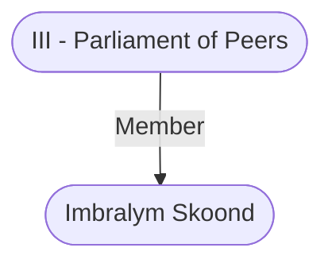

# Imbralym Skoond
## Overview
**Race**: Human
#Race/Human

**Gender**: Male
#Gender/Male

**Age**: Adult
#Age/Adult

**Class**: Commoner
#Class/Commoner

### Imbralym Skoond
![[Imbra.png|Imbralym Skoond]]
[[Imbra.png|open outside]]

This greedy, amoral, young wizard is graceful, charm ing, and darkly handsome. He was a dancing master in Athkatla until he discovered his aptitude for the magical arts and began dreaming about the immense wealth that a successful wizard could amass. He left his home to seek out a wellheeled sponsor among the upper crust of Bal dur’s Gate. Thanks to his charm, a talent for magic, and no apparent scruples, Skoond quickly attracted Duke Silvershield’s attention as a threat and then, when Skoond proved amenable, as a subordinate. Silvershield used his influ ence to have Skoond made a peer (parliament’s most recent appointment), and the wizard has been the duke’s lapdog ever since.

With the first earnings he received from Silver shield, Imbralym bought the leaky, drafty Seskergates mansion in the [[Bloomridge]] district. The place was on sale for a song, since it’s adjacent to [[Mandorcai's Mansion|Mandorcai’s Mansion]]. Since he moved in, Skoond has heard a few strange sounds from Mandorcai’s but nothing to indi cate any danger to him. As an added bonus, fear of [[Mandorcai's Mansion|Mandorcai’s Mansion]] has helped keep snoops away from his own residence.

---
## Connections

%%
links: [ [[ III - Parliament of Peers]] ]
%%

---
## Tags
#Import/Forgotten-Realms-Atlas

