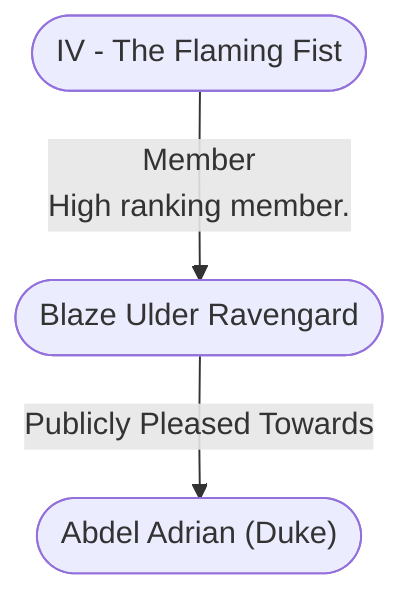

# Blaze Ulder Ravengard
## Overview
**Race**: Human
#Race/Human

**Gender**: Male
#Gender/Male

**Age**: Adult
#Age/Adult

**Class**: Fighter
#Class/Fighter

### Portrait
![[blaze.png|Portrait]]
[[blaze.png|open outside]]

## Profile
**Appearance Traits**: Unadorned
#Appearance-Trait/Unadorned

**Social Traits**: Demanding, Intolerant
#Social-Trait/Demanding #Social-Trait/Intolerant

Ulder Ravengard is the leader of [[IV - The Flaming Fist|the Flaming Fist]]—the military might of [[1. Story World Almanac/Forgotten Realms/Toril/Faerun/1 - World Above/Baldur's Gate/Baldur's Gate|Baldur’s Gate]]. He has the greatest martial acumen of anyone at the council (and probably in the whole Lords’ Alliance). He can also muster more soldiers than any other delegate, and he is not bashful about saying so. His place is at the head of the war council and the front of the battle—but he w ill take that place only if the party proves worthy of his trust. Ravengard is a stern warrior dedicated to discipline and results.

Having risen through the ranks of the Flam ing Fist by the might of his blade and the sharpness of his wits, he sometimes lacks sophistication and tact, but he possesses an unwavering commitment to the law. More comfortable working with soldiers than adventurers, Ravengard is used to giving orders and having them obeyed without question. Though [[1. Story World Almanac/Forgotten Realms/Toril/Faerun/1 - World Above/Baldur's Gate/Baldur's Gate|Baldur’s Gate]] is still recovering from the havoc caused by the resurrection within the city of Bhaal, god of murder, the metropolis remains one of Faerun’s most populous, wealthy, and powerful cities.

Ravengard recognizes his duty to protect the city above all else, and the Flam ing Fist’s tired reserves are desperately needed for reconstruction and policing. However, he would love to see [[IV - The Flaming Fist|the Flaming Fist]] take a leading role in the fight against the Cult of the Dragon, if only to give the defenders of [[1. Story World Almanac/Forgotten Realms/Toril/Faerun/1 - World Above/Baldur's Gate/Baldur's Gate|Baldur’s Gate]] a stature befitting the greatest city in Faerun. This opportunity for glory makes Ravengard receptive to De avonturiers’ overtures, as long as their plans and decisions promise stability and discipline.

## Story
Blaze Ulder Ravengard is the incarnation of milita rism. The only beauty he appreciates is precision, and the only quality he values is utility. He believes that personal ornamentation other than military insignia is a waste. A meticulous man, he forgets nothing and forgives less. Ravengard has never married and has no interest in domestic matters. Everything abotit him is geared toward prac ticality. Someone might consider him handsome, if not for his constant scowl and many scars.

Blaze Ravengard is Marshal [[Abdel Adrian (Duke)|Abdel Adrian]]’s right-hand man. He is both the second-highestranking officer in [[IV - The Flaming Fist|the Flaming Fist]] and the warden of [[Wyrm's Rock|Wyrm’s Rock]]. Ravengard’s soldiers do not love him. They do respect his leadership, however, and pay for it with their obedience, which is exactly how Ravengard prefers things.

Ravengard is the fourth son of a lowborn [[II - Lower City|Lower City]] smith. Since he had no hope of inheriting his father’s property, he decided to join [[IV - The Flaming Fist|the Flaming Fist]]. His discipline and meticulous nature helped Ravengard prove himself in battle and when handling day-to-day details for Adrian.

Naturally stolid and terse, Ravengard is slow to speak and make decisions in any arena except the battlefield. Once he decides on a course of action, Ravengard is relentless in its pursuit. He believes [[IV - The Flaming Fist|the Flaming Fist]] is the Gate’s backbone and the key to the city’s strength and superiority over its competitors.

Even though his rigorous self-control masks the depth of his feelings, the mercenary soldier seethes over the eagerness of ill-doers to control others, steal the fruits of honest folk’s labor, and otherwise misuse hardworking people. Therefore, he is determined to ground [[VI - The Guild|the Guild]] into dust. Ravengard believes that the criminal organization is waging a war against Baldurians, and he is determined to win it for them. He knows as well as anyone else, though, that wars aren’t won without casualties or collateral damage. What Ravengard doesn’t realize, however, is that he has a subconscious blind spot: He excuses all actions taken for the public good while simultaneously deplor ing identical deeds that others carry out for less altruistic reasons.

---
## Connections

%%
links: [ [[ Abdel Adrian (Duke)]], [[ IV - The Flaming Fist]] ]
%%

---
## Tags
#Import/Forgotten-Realms-Atlas

