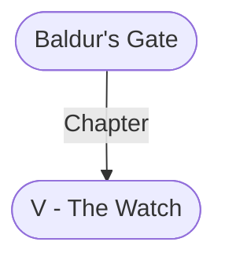

# V - The Watch
## Overview
**Type**: Military
#Organization/Military

**Military Role**: Logistics, Support
#Military-Role/Logistics #Military-Role/Support

The Watch is the official constabulary of [[1. Story World Almanac/Forgotten Realms/Toril/Faerun/1 - World Above/Baldur's Gate/Baldur's Gate|Baldur’s Gate]]. Although the Watch is technically the Gate’s only civil authority, its soldiers rarely leave the [[I - Upper City|Upper City]]. Most of the police work in the [[II - Lower City|Lower City]] is con ducted by [[IV - The Flaming Fist|the Flaming Fist]], and the [[III - Outer City|Outer City]] is left to fend for itself.

## Profile
The Watch is limited to civil police work, which means it has no jurisdiction outside the city. In wartime, its soldiers are prohibited from fight ing outside the city and its immediate environs. Such “foreign duty” is in the purview of [[IV - The Flaming Fist|the Flaming Fist]]. The Watch continuallypatrols the [[I - Upper City|Upper City]]’s walls. It’s said in [[Bloomridge]] that you can tell the passing of a quarter hour, day or night, by timing the interval between Watch patrols marching past a certain point.

At dusk, the Watch evicts everyone from the [[I - Upper City|Upper City]] except its residents and their invitation-carrying guests and livened servants. Watch soldiers, many of whom are lifelong [[I - Upper City|Upper City]] residents, pride them selves on recognizing every [[I - Upper City|Upper City]] citizen on sight. They also know every detail of how true patriars talk and behave, so they can often identify nighttime interlopers by watching suspects for a few minutes, getting a good look at their faces and garb, and asking a few questions.

The Watch is the only organization allowed to keep warhorses within the city’s walls. The Watch’s [[Stables|stables]] are in the Citadel. Its small, elite corps of knights responds quickly in times ofcrisis. The Watch has nine military ranks. In ascending authority, they are shield (private), sarniar (sergeant), vigilar (lieutenant), sword (captain), havilar (major), commandal (colonel), highsword (major general), and oversar (general). Six officers hold the rank of highsword, and two hold the rank of oversar. An oversar is always on duty and reports directly to the grand duke or the rest of [[I - The Council of Four|the Council of Four]] if the grand duke is unavailable.

The Watch employs around a thousand members, and a duty shift lasts for eight hours, so one-third of the force’s total strength, roughly three hundred sol diers and officers, is on active duty at any moment. Most patrol the [[I - Upper City|Upper City]]’s streets while their remaining comrades-in-arms stand sentry on the walls, train in the Citadel, or perform the hundreds of mundane tasks involved in keeping a police force functioning. A street patrol is composed of four to eight soldiers. Every Watch member carries a brass whistle with which to call for help if needed .. . and the nearest guard detachment is never very far away. In times ofcrisis, bells at the [[High Hall (The Ducal Palace)|High Hall]] and the Citadel are rung simultaneously. If the pealing continues for more than fifteen minutes—the time it should take a force to assemble at the Citadel and march to Black Dragon Gate—every Watch member is required to rally at the Citadel or along the [[I - Upper City|Upper City]]’s walls. The bells are rung only in emergencies that threaten the entire [[I - Upper City|Upper City]], such as an invading army, a city wide fire, or any scenario that threatens to overwhelm the soldiers on duty. The Citadel, the ‘Watch’s headquarters, is a massive keep built at an angle into the [[I - Upper City|Upper City]]’s walls.

The Citadel has its own water supply and is amply provi sioned to withstand a months-long siege. Long ago, the Citadel’s dungeons were the only prison in [[1. Story World Almanac/Forgotten Realms/Toril/Faerun/1 - World Above/Baldur's Gate/Baldur's Gate|Baldur’s Gate]]. They are seldom used now, and only for the purpose of housing suspects awaiting trial in the [[High Hall (The Ducal Palace)|High Hall]] or sequestering patriars or their servants when such imprisonment must remain quiet. All other prisoners are locked up in [[The Seatower of Balduran|the Seatower of Balduran]].

---
## Governed Content
- [[Lenta Moore (Vigilar)]]

---
## Connections

%%
links: [ [[ 1. Story World Almanac/Forgotten Realms/Toril/Faerun/1 - World Above/Baldur's Gate/Baldur's Gate]] ]
%%

---
## Tags
#Import/Forgotten-Realms-Atlas

