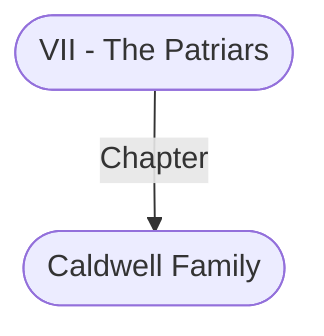

# Caldwell Family
## Overview
**Type**: Family
#Organization/Family

**Family Notability**: Commerce
#Family-Activity/Commerce

Lord Wyllyck Caidwell is the patriarch of one of the city’s oldest and richest families; of course, their great wealth still cannot rival the Silvershields’. Vast apple and pear orchards south of the city were the Caidwells’ source of income. But about fifty years ago, a rotting disease struck the trees. Wvllyck, then a young, talented [[Alchemist|alchemist]], searched for a cure. He never found it, but the disease ran its course, and the orchards recovered. Fortuitously, during his research, Wyllyck discovered a wood-treatment method that safeguards timber from water better than any paint or polish.

Wyllyck’s wife, Lady Abelea, recognized and exploited Wyllyck’s discovery, and the Caldwell family now owes the bulk of its financial success to her. Abelea has since managed the expansion of the fam ily’s operations. Now, in addition to business from their orchards, the Caldwells import raw timber and supply cut lumber to most of the area’s carpenters, coopers, wheelwrights, shipbuilders, and builders, as well as the priests of Gond. Additionally, the Caldwells are expanding into general river shipping and have pur chased two caravels, Sweetseed and Abelea, the latter named after Wyllyck’s wife.

The Caldwells are well regarded citywide. Wyllyck and Abelea are proud of their charitable works and [[II - Lower City|Lower City]] business investments. They donate gener ously to the [[High House of Wonders (Temple of Gond)|High House of Wonders]], [[The Watchful Shield (Shrine of Helm)|the Watchful Shield]], the Shrine of the Suffering, and the Church of Last Hope.

Caldwell is a modest man who recognizes that his alchemical research would not have been possible without his family’s legacy, and that his business suc cess is due to Abelea’s management sense. He ignores invitations to patriars’ galas, because he believes his peers are too concerned with their own pleasure and too removed from the troubles of the Lower and Outer cities. In leisure times, he prefers to read in his study or discuss alchemy with colleagues at tables in [[The Wide (Open Marketplace)|the Wide]].

---
## Connections

%%
links: [ [[ VII - The Patriars]] ]
%%

---
## Tags
#Import/Forgotten-Realms-Atlas

