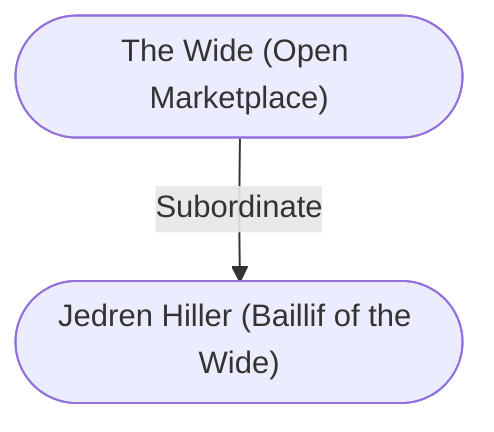

# Jedren Hiller (Baillif of the Wide)
## Professional Life
Someone has to the record the names and goods of sellers, manage disputes over stall space, and schedule [[The Wide (Open Marketplace)|the Wide]]’s nighttime use to balance the concerns of competing patriars. These and many other unenviable tasks falls to the bailiff of [[The Wide (Open Marketplace)|the Wide]].

Each morning, Baliff of [[The Wide (Open Marketplace)|the Wide]] Jedren Hiller wakes before dawn, meets his officers and assistants around [[The Beloved Ranger|the Beloved Ranger]] for a quick discussion of the changes for the day, and then heads to [[1. Story World Almanac/Forgotten Realms/Toril/Faerun/1 - World Above/Baldur's Gate/Baldur's Gate|Baldur’s Gate]]. While the assistants scatter across [[The Wide (Open Marketplace)|the Wide]] to mark out stall placements with chalk, half the officers line up around the inside of [[1. Story World Almanac/Forgotten Realms/Toril/Faerun/1 - World Above/Baldur's Gate/Baldur's Gate|Baldur’s Gate]] to hand out stall-marker chits while the other half goes to the Black Dragon Gate. Bailiff Hiller then squeezes out through the gate and begins assigning stall space to the merchants who have come for the day.

Merchants who live in the [[I - Upper City|Upper City]] receive their stall markers early each day by nighttime doorstop deliveries, and they begin setting up as soon as the stalls are chalked. Anyone who forgot to request a stall on the previous day must wait for Bailiff Hiller to pass through [[The Wide (Open Marketplace)|the Wide]] on his way to Black Dragon Gate after he finishes making the [[1. Story World Almanac/Forgotten Realms/Toril/Faerun/1 - World Above/Baldur's Gate/Baldur's Gate|Baldur’s Gate]] assignments. The bailiff gives out stall assignments according to a complicated formula that accounts for similarity of goods, the length of time a merchant has been selling in [[The Wide (Open Marketplace)|the Wide]], one’s past infractions such as crossing a stall boundary, and rotating the best sellers through the best locations for fairness. Of course, everyone knows that a little something extra can improve your standing in the Registry, the ledger of [[The Wide (Open Marketplace)|the Wide]]’s market and social activity that is Bailiff 1-liller’s constant companion.

The bailiff of [[The Wide (Open Marketplace)|the Wide]] works under the auspices of [[Haxilion Trood (Purse Master)|Haxilion Trood]], the city’s purse master. Trood is a meticulous coin-counter, so Hiller has been obliged to turn down cash bribes. But giving him and his hungry crew some samples of food, or making deliveries to his home of various goods “for inspection” is still quite welcome (and often necessary if a merchant doesn’t wish to languish in a less traveled area or some other unfortunate locale). What a shame it would be for the Registry to dictate that a perfumer ended up next to someone selling roast meat?

---
## Connections

%%
links: [ [[ The Wide (Open Marketplace)]] ]
%%

---
## Tags
#Import/Forgotten-Realms-Atlas

