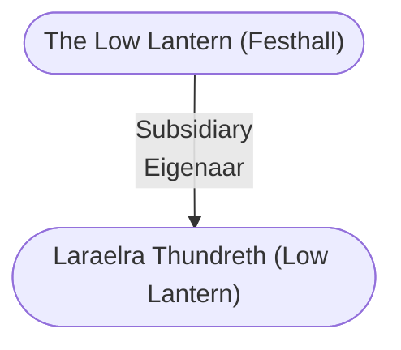

# Laraelra Thundreth (Low Lantern)
## Overview
**Alignment**: Neutral
#Alignment/Neutral

**Challenge**: CR 1
#Challenge-Rating/CR-1

**Race**: Human
#Race/Human

**Gender**: Female
#Gender/Female

**Age**: Adult
#Age/Adult

**Class**: Commoner
#Class/Commoner

**Character Role**: Neutral
#Character-Role/Neutral

### Portrait
![[weuuysgy.udh.png|Portrait|300]]
[[weuuysgy.udh.png|open outside]]

Captain of [[The Low Lantern (Festhall)|the Low Lantern]] in [[II - Lower City|Lower City]].

## Profile
**Appearance Traits**: Beautiful, Slender
#Appearance-Trait/Beautiful #Appearance-Trait/Slender

**Social Traits**: Impartial, Stingy
#Social-Trait/Impartial #Social-Trait/Stingy

Grijnst altijd.

## Story
Heeft Kima geholpen in haar zoektocht naar Magere Pieter.

## Possessions
Was op zoek naar de Tranen van Tymora. Kima heeft die voor haar gevonden.

---
## Connections

%%
links: [ [[ The Low Lantern (Festhall)]] ]
%%

---
## Tags
#Import/Forgotten-Realms-Atlas

