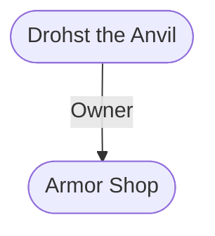

# Drohst the Anvil
## Overview
**Alignment**: Neutral
#Alignment/Neutral

**Race**: Human
#Race/Human

**Gender**: Male
#Gender/Male

**Age**: Adult
#Age/Adult

**Class**: Commoner
#Class/Commoner

**Character Role**: Neutral
#Character-Role/Neutral

### Portrait
![[z_Assets/zz_asset-files 1/jqgi35nj.gmi.png|Portrait]]
[[z_Assets/zz_asset-files 1/jqgi35nj.gmi.png|open outside]]

Drohst the Anvil

Rebellious Blacksmith

*“Did that guard give me a suspicious look? No? Oh, good. I thought he might know about the armory in my cellar.”*

**Appearance:** Built like a barrel on legs, Drohst has bushy black eyebrows, a manly beard, and callused hands.

**Roleplaying:** Drohst has a gentle manner that belies his size. He jokes often about what might happen if the kingdom were taken over by an evil wizard, and will show off his preparations to anyone he trusts.

**Personality:** Calm, sensible, and easy to get along with, Drohst loves being a smith, but he knows it’s not what destiny has in store for him. He’s earnest and naïve, but has the charm of a natural leader.

**Motivation:** Drohst takes the measure of everyone he meets, trying to see what role they might play in a rebellion. He rarely puts down his hammer.

**Background:** A skilled blacksmith, Drohst’s true calling is uprising: He fancies himself to be a future rebel leader, running a resistance movement out of his smithy. The catch is that he doesn’t have anything to rebel against—but he can’t get the idea out of his head. He’s spent so much time thinking about and planning for his fictitious rebellion that, if a rebellion was warranted, he’d actually make an excellent resistance leader. He’s widely respected, has a large cache of weapons, and knows everyone in [[G6 - Town|town]].

**Traits:** *(MR) Business, charming, crafter, humorous, leader, merchant*

---
## Connections

%%
links: [ [[ Armor Shop]] ]
%%

---
## Tags
#Import/Forgotten-Realms-Atlas #Utility/Empty #Source-Books/Princes-of-the-Apocalypse

