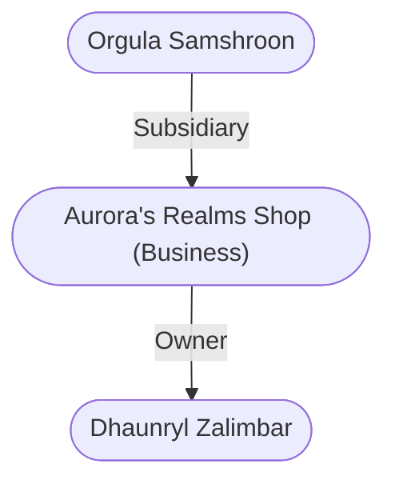

# Aurora's Realms Shop (Business)
## Overview
This is the [[Trades Ward]] outlet of the famous [[1. Story World Almanac/Forgotten Realms/Toril/Faerun/1 - World Above/Faerun]]-wide all goods retail chain. Located on the northwest corner of the meeting of the Street of the Tusks and the [[High Road]], this shop has six guards (shifts of three and three), a stout, motherly matron of a counter clerk named [[Orgula Samshroon]], and a tall, kindly service-mage called [[Dhaunryl Zalimbar]].

## Goods and Services
### Smart Image (Map)
![[Shop With Cellar.png|Smart Image (Map)|300]]
[[Shop With Cellar.png|open outside]]

---
## Connections

%%
links: [ [[ Dhaunryl Zalimbar]], [[ Orgula Samshroon]] ]
%%

---
## Tags
#Utility/Empty #Import/Forgotten-Realms-Atlas

