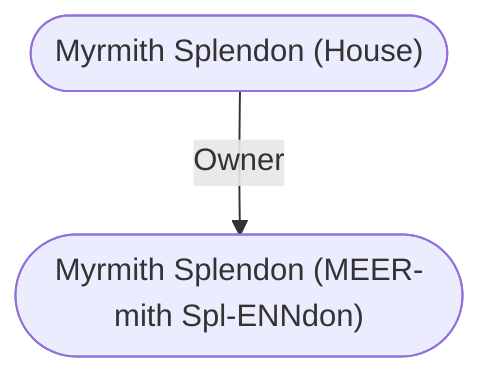

# Myrmith Splendon (House)
## Overview
### Smart Image (Map)

```leaflet
id: Smart Image (Map)
image: [[Volo 5292.PNG]]
height: 427.4px
draw: false
showAllMarkers: true
preserveAspect: true
bounds:
    - [0, 0]
    - [213.7, 300.0]
marker: default, 112.0, 204.5,[[Mahir's Tower (Wizard Domicile)]]
marker: default, 82.8, 136.2,[[Myrmith Splendon (House)]]
marker: default, 189.9, 58.3,[[Inn of the Dripping Dagger (Inn)]]
marker: default, 156.8, 51.0,[[The Riven Shield Shop (Business)]]
```
[[Volo 5292.PNG|open outside]]

### The Snookery (pic)
![[5ocjwykn.fw4.png|The Snookery (pic)|300]]
[[5ocjwykn.fw4.png|open outside]]

This is the house of the noted Captain-at-Arms (weapons tutor) [[Myrmith Splendon (MEER-mith Spl-ENNdon)|Myrmith Splendon]].22 Its a rambling old place with stone walls and barred windows. Its exterior doors are covered with plating made from old armor, hammered flat. From inside, there is often a muted din similar to the sounds of a foundry, as Myrmiths students repair weapons they have damaged, or modify those they wield, or simply use them on each other. Some have been known to practice the knack of driving an adamantine sword through armor plate for days.

Here Myrmith trains all who can pay his steep fees in advance23 in the use of weaponry of all sorts; he has mastered an amazing variety of weapons and has specimens of them all here for daily use.

Those planning on robbing Myrmiths house are warned that no one knows just what he does with his gold, that the snooks (griffon-like animated stone statues, something like gargoyles) which adorn the roof of the house are intelligent and formidable guardians. Not only would robbers have to contend with the snooks, but at least seven magical flying daggers24 also steadfastly guard the place.

> [!quote] Callout
> 22Location #170 on the color map.
> 
> 23 Myrmith can use any weapon the DM desires and can train a character in the use of it thoroughly or assist warriors in improving their overall battle skills enough to allow them to advance a level in expertise. His fees are 190 gp/level per week. His skill is such that training, even when the house is full of students learning simultaneously, will take the minimum time necessary.
> 
> 24 As Myrmiths wizard friends are continually experimenting with and improving on the snooks, the DM is free to improve upon the powers of a gargoyle in any way desired. All snooks (there are at least 6 active at all times) are LN in alignment,and unshakably loyal to Myrmith. Even magic cannot turn them against him. Flying daggers are fully detailed on page 115 of the Campaign Guide to [[Undermountain]] book (in the Ruins of [[Undermountain]] boxed set). Myrmiths version of these self-animated flying weapons are AC5; MV Fl21 (A); HD 1+1; hp 9; THAC0 17; #AT 2; Dmg 1-4; get no attack bonuses but are considered +2 magical weapons for purposes of what they can hit; cannot be affected by any type of magical or psionic control except by Myrmith; and are immune to magic missile spells and all lightning or electrical-based magic, which they reflect back 100% on the source!
> 

---
## Connections

%%
links: [ [[ Myrmith Splendon (MEER-mith Spl-ENNdon)]] ]
%%


---
## Tags
#Utility/Empty #Import/Forgotten-Realms-Atlas

