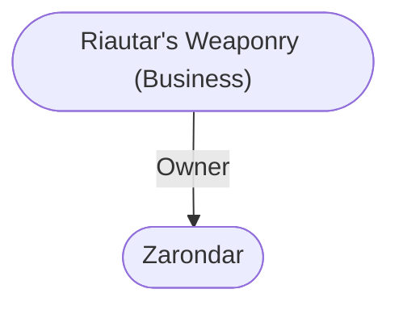

# Riautar's Weaponry (Business)
## Overview
This shop fronts on the [[High Road]] just east of the Street of the Tusks29 and is crowded with an assortment of ready weaponry; most of it secondhand. It is notable as the source of the best arrows, bowstrings, and long bows in [[Waterdeep]], made on the premises by the owner. Their superlative workmanship is admired and coveted by all archers who see them.

A relic of [[Waterdeep|Waterdeeps]] past can also be seen on the roof of this shop. The crouching, fanged female figure with the spread wings is not a carved ornament, but a petrified harpy. She dates from the long-ago War of Five Wizards, when five mages battled their way across the city in one terrible night, vying for supremacy in the Wizards Guild of the timeand destroying most of the city in the process.

This harpy, along with two others, was *teleported* to [[Waterdeep]] from afar by one of the wizards, and another wizard promptly petrified them all. The other two harpies plunged to the street below. There they shattered and crushed the wizard who had summoned them. It is rumored that some mage in the city frees this harpy to fly and kill, at his commandfrom time to time, and then forces her back into her customary pose and stone shape, but this has never been proven to be more than a flight of fancy.

## Relationships
Proprietor: [[Zarondar]] the [[Zarondar|Nimble Riautar]], public contact for the Fellowship of Bowyers and Fletchers, is the proprietor.

---
## Connections

%%
links: [ [[ Zarondar]] ]
%%

---
## Tags
#Utility/Empty #Import/Forgotten-Realms-Atlas

