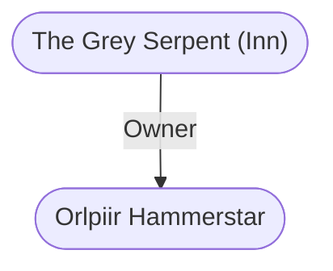

# The Grey Serpent (Inn)
## Overview
This sleek, fairly new expensive and high-class establishment stands on the east side of the Way of the Dragon, not far north from its intersection with Drakiir Street.36 Rooms here are a stiff 6 gp per night (single or double), but the furnishings are so clean and luxurious that this place outshines some noble villas Ive seen! Stabling and very fine house wine, but no food, is included in the room fee.

By special arrangement, apprentices of the Launderers Guild and the Order of Master Taylors are always on hand to whisk garments away for cleaning, alterations, or repairs. This is a cool, private place but truly the lap of luxury.

## Relationships
**Proprietor:** [[Orlpiir Hammerstar]] runs the Grey Serpent. Hes a man with dwarven blood in his past, I was told. However, when I met him, he appeared very tall, thin, and austere, with a cultured voice and a beaky nose. The dwarven blood must be rather far back in his ancestry.

---
## Connections

%%
links: [ [[ Orlpiir Hammerstar]] ]
%%

---
## Tags
#Utility/Empty #Import/Forgotten-Realms-Atlas

