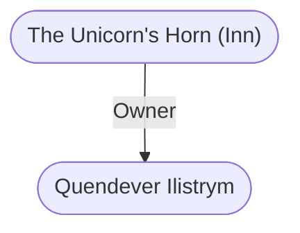

# The Unicorn's Horn (Inn)
## Overview
This fairly new inn occupies the most strategic location in [[Waterdeep]]: the northeast corner where the [[High Road]] meets [[Waterdeep]] Way and turns north.37 As you might expect, room fees are as high as a halfling after several kegs: 10 gp to 25 gp per night! Theres even an Imperial Suite of rooms on the top floor (the sixth) that costs 40 gp per night. Its windows command magnificent views of the city on three sides.

The furnishings are opulent, but not very tasteful. Huge tapestries and heavily gilded, massive pieces of furniture are everywhere. The canopied beds are the only comfortable place to sit in the entire inn.

Servants carry your bags, stable your mounts for you, bring a light evening meal with wine to your room, and hot spiced wine and hot water for a bath in the morningbut thats the extent of the service. Theres a locked, guarded warehouse for wagons, carts, and coaches available as part of the room fee.

All in all, it is impressive, but not relaxing, or worth the money. Stay somewhere cheaper, and go to a nobles feast if you want to be overwhelmed with haughty luxury instead.

## Relationships
**Proprietor:** [[Quendever Ilistrym]] owns and runs this inn. He is a haughty effete man of excellent cheekbones and breeding, but little energy or competence that I could see.

---
## Connections

%%
links: [ [[ Quendever Ilistrym]] ]
%%

---
## Tags
#Utility/Empty #Import/Forgotten-Realms-Atlas

