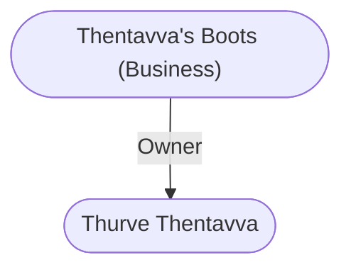

# Thentavva's Boots (Business)
## Overview
This old, narrow shop on Vellarr s Lane is adorned with the carved stone images of frolicking nymphs and pegasi.27 Inside, the crowded interior smells strongly of leather. Here a man considered by some to be the best cobbler in [[Waterdeep]] makes custom footwear for all. His thigh-high, sleek, pointedtoed ladies boots are famous and eagerly sought after, even at the steep price of 10 gp and the waiting period of at least nine days, but the shop is also full of slippers, walking boots, and the like. [[Thurve Thentavva|Thentavva]]n work is of the best quality, known for lasting many years and surviving mud and wet well.

## Goods and Services
**Goods Sold**: Clothing
#Goods-Type/Clothing

**Services Sold**: Crafting
#Service/Crafting

## Relationships
**Proprietor:** [[Thurve Thentavva]], the cobbler supreme and proprietor of Thentavvas Boots, is calm, bespectacled, and unflappable.

---
## Connections

%%
links: [ [[ Thurve Thentavva]] ]
%%

---
## Tags
#Utility/Empty #Import/Forgotten-Realms-Atlas

