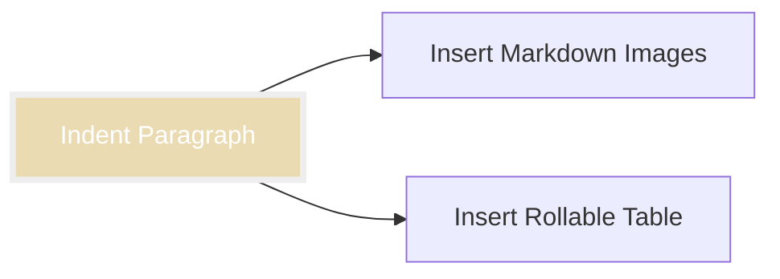
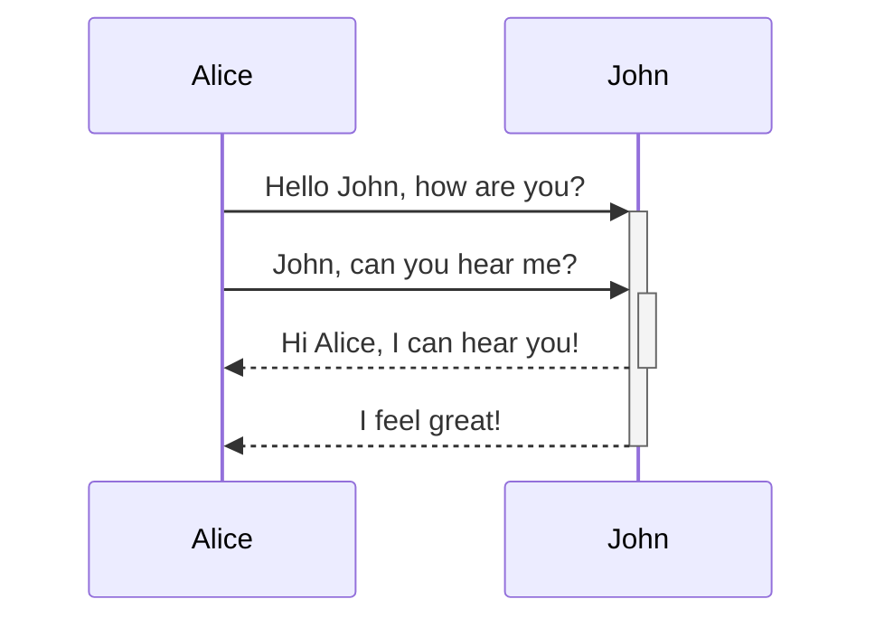
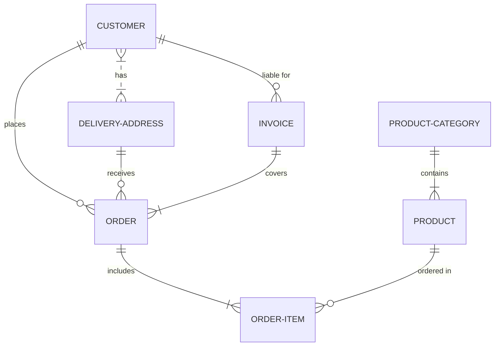
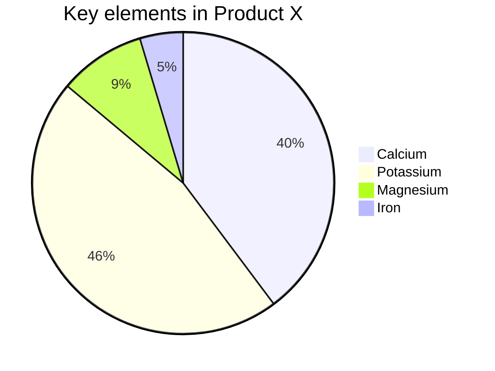
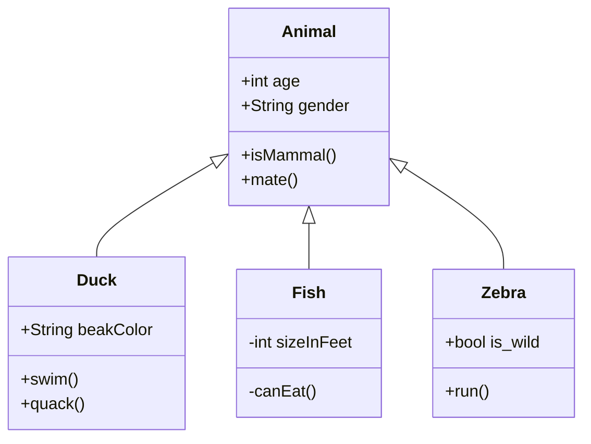
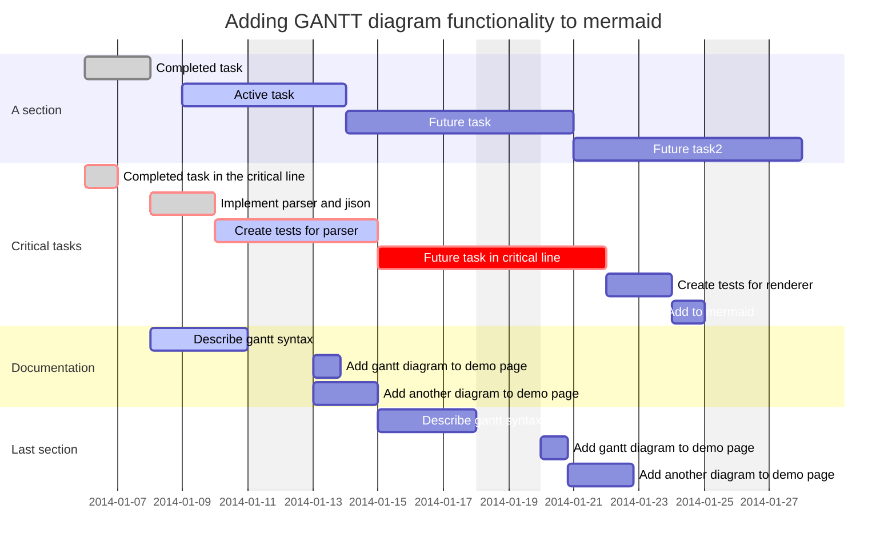
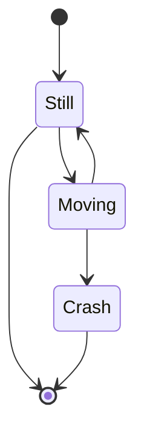
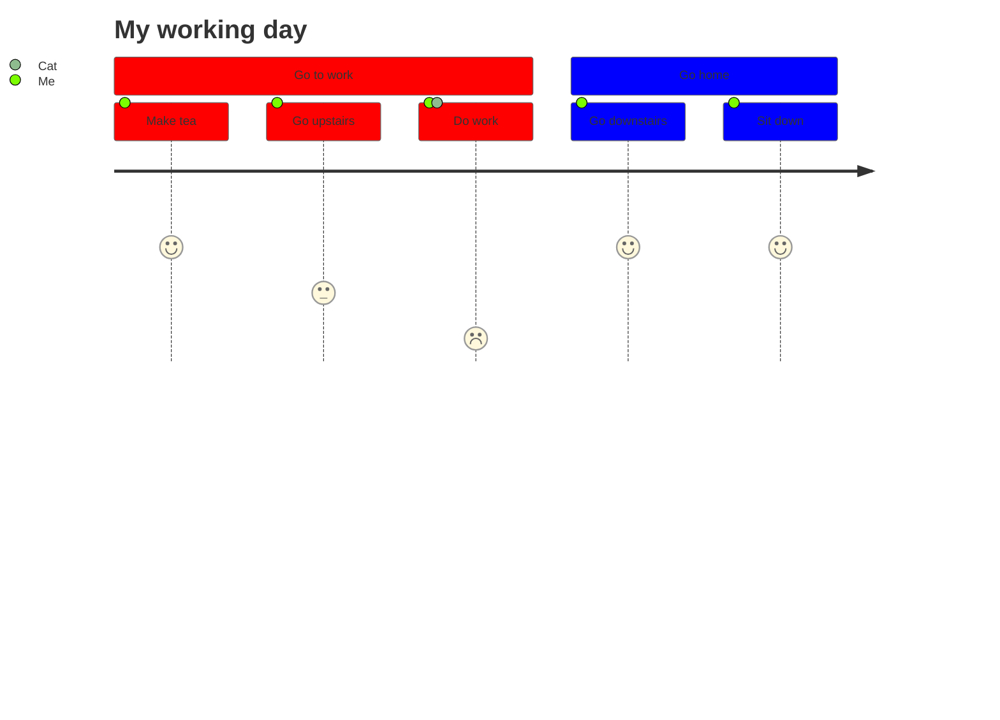

---
---

```mermaid
graph LR
  %%==============%%
  %% Declarations %%
  %%==============%%
    A[Indent Paragraph]
    B[Insert Markdown Images]
    C[Insert Rollable Table]
  %%=========%%
  %% Linking %%
  %%=========%%
  %% comment
  A --> B & C
 
  %% subgraph
  %% end
class A,B,C internal-link;
style A fill:#EBDBB2,stroke:#EEE,stroke-width:4px,color:#FFF
```

```mermaid
sequenceDiagram
  Alice->>+John: Hello John, how are you?
  Alice->>+John: John, can you hear me?
  John-->>-Alice: Hi Alice, I can hear you!
  John-->>-Alice: I feel great!
```

```mermaid
gitGraph:
options
{
  "nodeSpacing": 150,
  "nodeRadius": 10
}
end
commit
branch newbranch
checkout newbranch
commit
commit
checkout master
commit
commit
merge newbranch
```

```mermaid
erDiagram
    CUSTOMER }|..|{ DELIVERY-ADDRESS : has
    CUSTOMER ||--o{ ORDER : places
    CUSTOMER ||--o{ INVOICE : "liable for"
    DELIVERY-ADDRESS ||--o{ ORDER : receives
    INVOICE ||--|{ ORDER : covers
    ORDER ||--|{ ORDER-ITEM : includes
    PRODUCT-CATEGORY ||--|{ PRODUCT : contains
    PRODUCT ||--o{ ORDER-ITEM : "ordered in"
```

```mermaid
pie
  title Key elements in Product X
  "Calcium" : 42.96
  "Potassium" : 50.05
  "Magnesium" : 10.01
  "Iron" :  5
```

```mermaid
%% https://mermaid-js.github.io/mermaid/#/classDiagram
 classDiagram
  Animal <|-- Duck
  Animal <|-- Fish
  Animal <|-- Zebra
  Animal : +int age
  Animal : +String gender
  Animal: +isMammal()
  Animal: +mate()
  class Duck{
    +String beakColor
    +swim()
    +quack()
  }
  class Fish{
    -int sizeInFeet
    -canEat()
  }
  class Zebra{
    +bool is_wild
    +run()
  }
```

```mermaid
gantt
  dateFormat  YYYY-MM-DD
  title   Adding GANTT diagram functionality to mermaid
  excludes  weekends
  %% (`excludes` accepts specific dates in YYYY-MM-DD format, days of the week ("sunday") or "weekends", but not the word "weekdays".)

  section A section
    Completed task    :done,  des1, 2014-01-06,2014-01-08
    Active task     :active,  des2, 2014-01-09, 3d
    Future task     :   des3, after des2, 5d
    Future task2      :   des4, after des3, 5d

  section Critical tasks
    Completed task in the critical line :crit, done, 2014-01-06,24h
    Implement parser and jison    :crit, done, after des1, 2d
    Create tests for parser     :crit, active, 3d
    Future task in critical line    :crit, 5d
    Create tests for renderer     :2d
    Add to mermaid        :1d

  section Documentation
    Describe gantt syntax     :active, a1, after des1, 3d
    Add gantt diagram to demo page  :after a1  , 20h
    Add another diagram to demo page  :doc1, after a1  , 48h

  section Last section
    Describe gantt syntax     :after doc1, 3d
    Add gantt diagram to demo page  :20h
    Add another diagram to demo page  :48h
```

```mermaid
stateDiagram-v2
  [*] --> Still
  Still --> [*]
  Still --> Moving
  Moving --> Still
  Moving --> Crash
  Crash --> [*]
```

```mermaid
%%{init: {'theme': 'base', 'themeVariables': { 'primaryColor': '#ff0000'}}}%%
journey
  title My working day
 
  section Go to work
  Make tea: 5: Me
  Go upstairs: 3: Me
  Do work: 1: Me, Cat
 
  section Go home
  Go downstairs: 5: Me
  Sit down: 5: Me
```

![[The Journey Board|1000]]